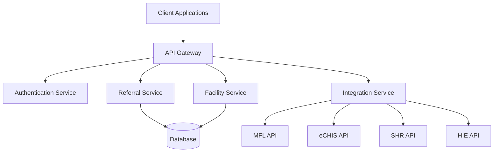
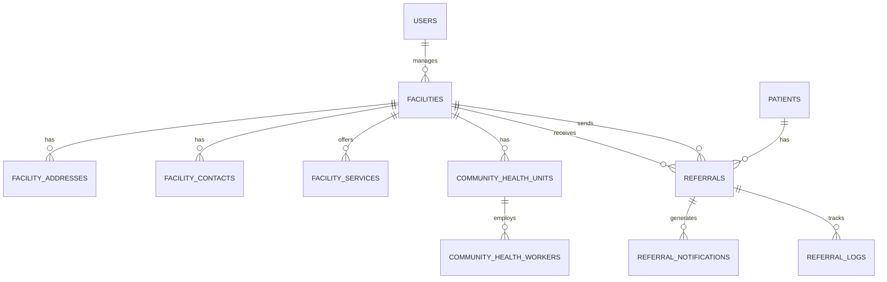
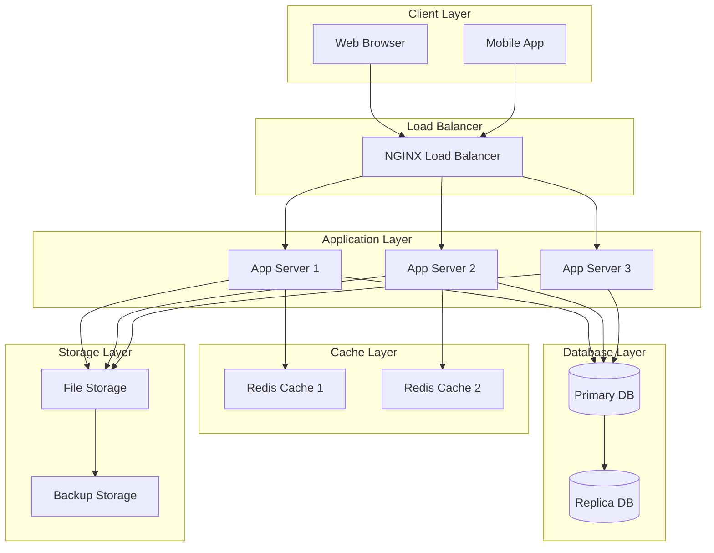
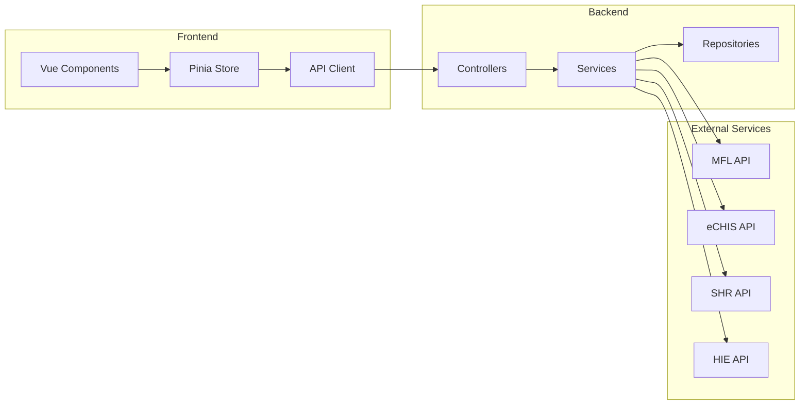
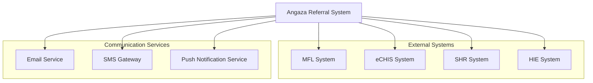
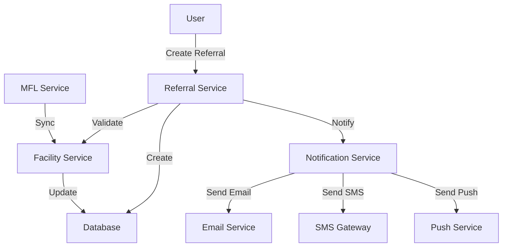

# System Architecture

## Overview

The Angaza Referral System follows a modern, scalable architecture designed to handle healthcare referrals efficiently while maintaining high security and performance standards.

## High-Level Architecture



## System Components

### 1. Frontend Layer
- **Web Application**
  - Vue.js 3 SPA
  - Vuetify 3 UI components
  - Responsive design
  - Progressive Web App capabilities

- **Mobile Application**
  - React Native
  - Offline capabilities
  - Push notifications

### 2. API Layer
- **API Gateway**
  - Request routing
  - Rate limiting
  - Request validation
  - Response caching

- **Authentication Service**
  - JWT token management
  - OAuth2 integration
  - Role-based access control
  - Session management

### 3. Core Services

#### Referral Service
- Referral creation and management
- Status tracking
- Workflow management
- Notification handling

#### Facility Service
- Facility management
- Service availability
- Capacity tracking
- Location services

#### Integration Service
- MFL synchronization
- eCHIS integration
- SHR integration
- HIE integration

### 4. Data Layer
- **Primary Database**
  - MySQL 8.0
  - Master-slave replication
  - Automated backups
  - Data encryption

- **Caching Layer**
  - Redis
  - Session storage
  - API response caching
  - Real-time data

### 5. Background Services
- **Queue System**
  - Laravel Queue
  - Job processing
  - Scheduled tasks
  - Event handling

- **Notification Service**
  - Email notifications
  - SMS integration
  - Push notifications
  - In-app notifications

## Security Architecture

### 1. Authentication
- Multi-factor authentication
- OAuth2 integration
- Session management
- Token-based authentication

### 2. Authorization
- Role-based access control
- Permission management
- API access control
- Resource-level permissions

### 3. Data Security
- Data encryption at rest
- TLS/SSL for data in transit
- Secure key management
- Regular security audits

## Integration Architecture

### 1. MFL Integration
- Real-time facility data
- Service availability
- Capacity updates
- Location information

### 2. eCHIS Integration
- Patient data synchronization
- Referral status updates
- Service availability
- Capacity management

### 3. SHR Integration
- Health record access
- Patient history
- Medical data exchange
- Consent management

### 4. HIE Integration
- Health information exchange
- Interoperability standards
- Data transformation
- Secure data transfer

## Deployment Architecture

### 1. Production Environment
- Load balancers
- Application servers
- Database servers
- Cache servers
- File storage

### 2. Staging Environment
- Mirror of production
- Testing capabilities
- Performance monitoring
- Security testing

### 3. Development Environment
- Local development
- Docker containers
- CI/CD pipeline
- Automated testing

## Monitoring and Logging

### 1. Application Monitoring
- Performance metrics
- Error tracking
- User activity
- System health

### 2. Infrastructure Monitoring
- Server metrics
- Network monitoring
- Resource utilization
- Capacity planning

### 3. Logging
- Application logs
- Access logs
- Error logs
- Audit trails

## Disaster Recovery

### 1. Backup Strategy
- Database backups
- File backups
- Configuration backups
- Regular testing

### 2. Recovery Procedures
- System restoration
- Data recovery
- Service continuity
- Incident response

## Performance Optimization

### 1. Caching Strategy
- API response caching
- Database query caching
- Static asset caching
- Session caching

### 2. Load Balancing
- Request distribution
- Health checks
- Auto-scaling
- Failover handling

## System Design

### 1. Entity Relationship Diagram (ERD)



### 2. Deployment Diagram



### 3. Component Interaction Diagram



### 4. System Context Diagram



### 5. Data Flow Diagram



## Future Considerations

### 1. Scalability
- Horizontal scaling
- Vertical scaling
- Microservices architecture
- Container orchestration

### 2. Integration
- New healthcare systems
- Standard protocols
- API versioning
- Service mesh

### 3. Innovation
- AI/ML capabilities
- Predictive analytics
- Real-time analytics
- Mobile enhancements 

## Database Schema and Relationships

### Overview
The Angaza Referral System uses a relational database design with the following key entities:
- Users (Administrators, Facility Staff)
- Facilities (Hospitals, Clinics, Health Centers)
- Referrals (Patient Transfers)
- Community Health Units
- Integration Logs

### Entity Relationship Diagram


### Key Relationships
1. **User-Facility Relationship**
   - One-to-Many: A user can be associated with one facility
   - A facility can have multiple users
   - Users have specific roles within facilities

2. **Facility-Referral Relationship**
   - One-to-Many: A facility can send multiple referrals
   - One-to-Many: A facility can receive multiple referrals
   - Referrals track both sending and receiving facilities

3. **Facility-CHU Relationship**
   - One-to-Many: A facility can have multiple CHUs
   - CHUs are managed by facilities
   - CHUs can have multiple health workers

4. **Patient-Referral Relationship**
   - One-to-Many: A patient can have multiple referrals
   - Referrals are always associated with a patient
   - Referral history is maintained for each patient

## API Documentation

### Overview
The Angaza Referral System provides a RESTful API with the following key features:
- JWT-based authentication
- Role-based access control
- Pagination and filtering
- Real-time updates
- Integration endpoints

### API Versioning
```http
Base URL: https://api.angaza-referral.com/v1
```

### Authentication
All API requests require a valid JWT token in the Authorization header:
```http
Authorization: Bearer <token>
```

### Rate Limiting
- 100 requests per minute per IP
- 1000 requests per hour per user
- Rate limit headers included in responses

### Error Handling
```json
{
    "error": {
        "code": "VALIDATION_ERROR",
        "message": "Invalid input data",
        "details": {
            "field": ["Error message"]
        }
    }
}
```

### Common Response Formats
```json
{
    "data": {
        // Response data
    },
    "meta": {
        "current_page": 1,
        "total": 100,
        "per_page": 15
    },
    "links": {
        "first": "https://api.angaza-referral.com/v1/resource?page=1",
        "last": "https://api.angaza-referral.com/v1/resource?page=7",
        "prev": null,
        "next": "https://api.angaza-referral.com/v1/resource?page=2"
    }
}
```

## Testing Strategy

### Overview
The testing strategy for the Angaza Referral System follows a comprehensive approach:
- Unit Testing
- Feature Testing
- Integration Testing
- API Testing
- Performance Testing
- Security Testing

### Test Categories

#### 1. Unit Tests
- Test individual components in isolation
- Focus on business logic
- Mock external dependencies
- High coverage of core functionality

#### 2. Feature Tests
- Test complete features end-to-end
- Include user interactions
- Test business workflows
- Validate data integrity

#### 3. Integration Tests
- Test system integrations
- Validate external service interactions
- Test data synchronization
- Verify error handling

#### 4. API Tests
- Test API endpoints
- Validate request/response formats
- Test authentication and authorization
- Verify rate limiting

#### 5. Performance Tests
- Test system under load
- Measure response times
- Identify bottlenecks
- Validate scalability

### Test Environment
```yaml
environments:
  local:
    database: mysql
    cache: redis
    queue: sync
  
  testing:
    database: mysql_test
    cache: redis_test
    queue: sync
  
  staging:
    database: mysql_staging
    cache: redis_staging
    queue: redis
```

### Test Data Management
```php
class TestDataSeeder extends Seeder
{
    public function run()
    {
        // Create test users
        User::factory()->count(10)->create();
        
        // Create test facilities
        Facility::factory()->count(5)->create();
        
        // Create test referrals
        Referral::factory()->count(20)->create();
    }
}
```

## Database Migrations

### Overview
The migration system follows these principles:
- Version control for database changes
- Reversible migrations
- Data integrity preservation
- Environment-specific configurations

### Migration Structure
```bash
database/
├── migrations/
│   ├── 2024_03_21_000001_create_users_table.php
│   ├── 2024_03_21_000002_create_facilities_table.php
│   ├── 2024_03_21_000003_create_patients_table.php
│   ├── 2024_03_21_000004_create_referrals_table.php
│   ├── 2024_03_21_000005_create_community_health_units_table.php
│   └── 2024_03_21_000006_create_community_health_workers_table.php
└── seeders/
    ├── DatabaseSeeder.php
    ├── UserSeeder.php
    ├── FacilitySeeder.php
    └── CommunityHealthUnitSeeder.php
```

### Migration Commands
```bash
# Create a new migration
php artisan make:migration create_table_name_table

# Run migrations
php artisan migrate

# Rollback last migration
php artisan migrate:rollback

# Refresh all migrations
php artisan migrate:refresh

# Run specific migration
php artisan migrate --path=/database/migrations/2024_03_21_000001_create_users_table.php
```

### Migration Best Practices
1. **Naming Conventions**
   - Use descriptive names
   - Include timestamp prefix
   - Follow Laravel conventions

2. **Data Integrity**
   - Use foreign key constraints
   - Implement cascading deletes where appropriate
   - Add indexes for performance

3. **Version Control**
   - Commit migrations with code changes
   - Document migration purposes
   - Test migrations in all environments

4. **Rollback Strategy**
   - Ensure migrations are reversible
   - Handle data preservation
   - Test rollback procedures

### Example Migration
```php
class CreateReferralsTable extends Migration
{
    public function up()
    {
        Schema::create('referrals', function (Blueprint $table) {
            $table->id();
            $table->foreignId('patient_id')->constrained();
            $table->foreignId('from_facility_id')->constrained('facilities');
            $table->foreignId('to_facility_id')->constrained('facilities');
            $table->string('status');
            $table->text('notes')->nullable();
            $table->timestamps();
            
            // Add indexes
            $table->index(['status', 'created_at']);
            $table->index(['from_facility_id', 'to_facility_id']);
        });
    }

    public function down()
    {
        Schema::dropIfExists('referrals');
    }
}
```

## Database Optimization

### 1. Query Optimization

#### Eager Loading
```php
// Instead of N+1 queries
$facilities = Facility::with(['referrals', 'communityHealthUnits'])->get();

// Using chunk for large datasets
Facility::chunk(100, function ($facilities) {
    foreach ($facilities as $facility) {
        // Process each facility
    }
});
```

#### Index Usage
```sql
-- Composite indexes for common queries
CREATE INDEX idx_referrals_status_created ON referrals(status, created_at);
CREATE INDEX idx_facilities_type_status ON facilities(type, status);

-- Partial indexes for specific conditions
CREATE INDEX idx_active_facilities ON facilities(id) WHERE status = 'active';
```

### 2. Caching Strategies

#### Model Caching
```php
class Facility extends Model
{
    public function getCachedFacilities()
    {
        return Cache::remember('facilities.all', 3600, function () {
            return $this->with(['referrals'])->get();
        });
    }
}
```

#### Query Result Caching
```php
class ReferralService
{
    public function getActiveReferrals()
    {
        $cacheKey = 'referrals.active.' . auth()->id();
        
        return Cache::remember($cacheKey, 300, function () {
            return Referral::where('status', 'active')
                ->where('from_facility_id', auth()->user()->facility_id)
                ->get();
        });
    }
}
```

### 3. Database Maintenance

#### Regular Maintenance Tasks
```sql
-- Analyze table statistics
ANALYZE TABLE facilities, referrals, patients;

-- Optimize tables
OPTIMIZE TABLE facilities, referrals, patients;

-- Check and repair tables
CHECK TABLE facilities, referrals, patients;
REPAIR TABLE facilities, referrals, patients;
```

#### Partitioning Strategy
```sql
-- Partition referrals by date
ALTER TABLE referrals
PARTITION BY RANGE (TO_DAYS(created_at)) (
    PARTITION p_2024_01 VALUES LESS THAN (TO_DAYS('2024-02-01')),
    PARTITION p_2024_02 VALUES LESS THAN (TO_DAYS('2024-03-01')),
    PARTITION p_2024_03 VALUES LESS THAN (TO_DAYS('2024-04-01')),
    PARTITION p_future VALUES LESS THAN MAXVALUE
);
```

### 4. Performance Monitoring

#### Slow Query Log
```sql
-- Enable slow query log
SET GLOBAL slow_query_log = 'ON';
SET GLOBAL long_query_time = 2;
SET GLOBAL slow_query_log_file = '/var/log/mysql/slow-query.log';

-- Analyze slow queries
mysqldumpslow /var/log/mysql/slow-query.log
```

#### Query Performance Analysis
```sql
-- Explain query execution plan
EXPLAIN SELECT * FROM referrals 
WHERE status = 'pending' 
AND created_at > DATE_SUB(NOW(), INTERVAL 24 HOUR);

-- Show index usage
SHOW INDEX FROM referrals;
```

### 5. Advanced Query Optimization

#### Query Hints
```sql
-- Force index usage
SELECT /*+ INDEX(facilities idx_facilities_type_status) */
    id, name, type, status
FROM facilities
WHERE type = 'hospital' AND status = 'active';

-- Optimize join order
SELECT /*+ ORDERED */
    r.*, f.name as facility_name
FROM referrals r
JOIN facilities f ON r.from_facility_id = f.id
WHERE r.status = 'pending';
```

#### Materialized Views
```sql
-- Create materialized view for facility statistics
CREATE MATERIALIZED VIEW facility_statistics AS
SELECT 
    f.id,
    f.name,
    COUNT(r.id) as total_referrals,
    COUNT(CASE WHEN r.status = 'pending' THEN 1 END) as pending_referrals,
    AVG(TIMESTAMPDIFF(HOUR, r.created_at, r.updated_at)) as avg_processing_time
FROM facilities f
LEFT JOIN referrals r ON f.id = r.from_facility_id
GROUP BY f.id, f.name;

-- Refresh materialized view
REFRESH MATERIALIZED VIEW facility_statistics;
```

### 6. Advanced Caching Strategies

#### Multi-level Caching
```php
class FacilityService
{
    public function getFacilityWithStats($id)
    {
        // Try L1 cache (memory)
        $cacheKey = "facility.{$id}.stats";
        if ($cached = $this->memoryCache->get($cacheKey)) {
            return $cached;
        }
        
        // Try L2 cache (Redis)
        if ($cached = Cache::get($cacheKey)) {
            $this->memoryCache->put($cacheKey, $cached, 60);
            return $cached;
        }
        
        // Get from database
        $facility = Facility::with(['referrals', 'statistics'])
            ->findOrFail($id);
            
        // Cache in both levels
        $this->memoryCache->put($cacheKey, $facility, 60);
        Cache::put($cacheKey, $facility, 3600);
        
        return $facility;
    }
}
```

#### Cache Invalidation Strategies
```php
class ReferralService
{
    public function updateReferral($id, $data)
    {
        DB::transaction(function () use ($id, $data) {
            $referral = Referral::findOrFail($id);
            $referral->update($data);
            
            // Invalidate related caches
            Cache::tags(['referrals', "facility.{$referral->from_facility_id}"])->flush();
            
            // Update cache asynchronously
            dispatch(new UpdateReferralCache($referral));
        });
    }
}
```

### 7. Database Sharding

#### Sharding Strategy
```sql
-- Create sharded tables
CREATE TABLE referrals_2024_01 (
    LIKE referrals INCLUDING ALL
) INHERITS (referrals);

CREATE TABLE referrals_2024_02 (
    LIKE referrals INCLUDING ALL
) INHERITS (referrals);

-- Create sharding function
CREATE OR REPLACE FUNCTION referrals_insert_trigger()
RETURNS TRIGGER AS $$
BEGIN
    IF (NEW.created_at >= '2024-01-01' AND NEW.created_at < '2024-02-01') THEN
        INSERT INTO referrals_2024_01 VALUES (NEW.*);
    ELSIF (NEW.created_at >= '2024-02-01' AND NEW.created_at < '2024-03-01') THEN
        INSERT INTO referrals_2024_02 VALUES (NEW.*);
    END IF;
    RETURN NULL;
END;
$$ LANGUAGE plpgsql;
```

### 8. Advanced Monitoring

#### Custom Metrics Collection
```sql
-- Create metrics table
CREATE TABLE performance_metrics (
    id SERIAL PRIMARY KEY,
    metric_name VARCHAR(50),
    metric_value FLOAT,
    timestamp TIMESTAMP DEFAULT CURRENT_TIMESTAMP
);

-- Collect query performance metrics
INSERT INTO performance_metrics (metric_name, metric_value)
SELECT 
    'avg_query_time',
    AVG(query_time)
FROM mysql.slow_log
WHERE start_time >= DATE_SUB(NOW(), INTERVAL 1 HOUR);
```

#### Automated Maintenance
```sql
-- Create maintenance procedure
DELIMITER //
CREATE PROCEDURE perform_maintenance()
BEGIN
    -- Analyze tables
    ANALYZE TABLE facilities, referrals, patients;
    
    -- Optimize tables
    OPTIMIZE TABLE facilities, referrals, patients;
    
    -- Update statistics
    ANALYZE TABLE performance_metrics;
    
    -- Clean up old data
    DELETE FROM performance_metrics 
    WHERE timestamp < DATE_SUB(NOW(), INTERVAL 30 DAY);
END //
DELIMITER ;

-- Schedule maintenance
CREATE EVENT maintenance_job
ON SCHEDULE EVERY 1 DAY
DO CALL perform_maintenance();
```

## Database Schema Documentation

### 1. Core Tables

#### Users Table
```sql
CREATE TABLE users (
    id BIGINT UNSIGNED AUTO_INCREMENT PRIMARY KEY,
    name VARCHAR(255) NOT NULL,
    email VARCHAR(255) UNIQUE NOT NULL,
    password VARCHAR(255) NOT NULL,
    role ENUM('admin', 'facility_admin', 'health_worker') NOT NULL,
    facility_id BIGINT UNSIGNED,
    remember_token VARCHAR(100),
    created_at TIMESTAMP NULL,
    updated_at TIMESTAMP NULL,
    FOREIGN KEY (facility_id) REFERENCES facilities(id)
) ENGINE=InnoDB;
```

#### Facilities Table
```sql
CREATE TABLE facilities (
    id BIGINT UNSIGNED AUTO_INCREMENT PRIMARY KEY,
    name VARCHAR(255) NOT NULL,
    code VARCHAR(50) UNIQUE NOT NULL,
    type ENUM('hospital', 'clinic', 'health_center') NOT NULL,
    status ENUM('active', 'inactive', 'maintenance') NOT NULL,
    mfl_code VARCHAR(50) UNIQUE NOT NULL,
    location VARCHAR(255) NOT NULL,
    created_at TIMESTAMP NULL,
    updated_at TIMESTAMP NULL
) ENGINE=InnoDB;
```

#### Referrals Table
```sql
CREATE TABLE referrals (
    id BIGINT UNSIGNED AUTO_INCREMENT PRIMARY KEY,
    patient_id BIGINT UNSIGNED NOT NULL,
    from_facility_id BIGINT UNSIGNED NOT NULL,
    to_facility_id BIGINT UNSIGNED NOT NULL,
    status ENUM('pending', 'in_transit', 'completed', 'cancelled') NOT NULL,
    notes TEXT,
    created_at TIMESTAMP NULL,
    updated_at TIMESTAMP NULL,
    FOREIGN KEY (patient_id) REFERENCES patients(id),
    FOREIGN KEY (from_facility_id) REFERENCES facilities(id),
    FOREIGN KEY (to_facility_id) REFERENCES facilities(id)
) ENGINE=InnoDB;
```

### 2. Supporting Tables

#### Referral Logs Table
```sql
CREATE TABLE referral_logs (
    id BIGINT UNSIGNED AUTO_INCREMENT PRIMARY KEY,
    referral_id BIGINT UNSIGNED NOT NULL,
    status VARCHAR(50) NOT NULL,
    notes TEXT,
    user_id BIGINT UNSIGNED NOT NULL,
    created_at TIMESTAMP NULL,
    FOREIGN KEY (referral_id) REFERENCES referrals(id),
    FOREIGN KEY (user_id) REFERENCES users(id)
) ENGINE=InnoDB;
```

#### Facility Services Table
```sql
CREATE TABLE facility_services (
    id BIGINT UNSIGNED AUTO_INCREMENT PRIMARY KEY,
    facility_id BIGINT UNSIGNED NOT NULL,
    service_name VARCHAR(255) NOT NULL,
    status ENUM('available', 'unavailable') NOT NULL,
    created_at TIMESTAMP NULL,
    updated_at TIMESTAMP NULL,
    FOREIGN KEY (facility_id) REFERENCES facilities(id)
) ENGINE=InnoDB;
```

### 3. Integration Tables

#### MFL Sync Logs Table
```sql
CREATE TABLE mfl_sync_logs (
    id BIGINT UNSIGNED AUTO_INCREMENT PRIMARY KEY,
    sync_type ENUM('facilities', 'chus', 'all') NOT NULL,
    status ENUM('success', 'failed') NOT NULL,
    records_processed INT NOT NULL,
    error_message TEXT,
    created_at TIMESTAMP NULL
) ENGINE=InnoDB;
```

#### Integration Settings Table
```sql
CREATE TABLE integration_settings (
    id BIGINT UNSIGNED AUTO_INCREMENT PRIMARY KEY,
    integration_type VARCHAR(50) NOT NULL,
    api_url VARCHAR(255) NOT NULL,
    api_key VARCHAR(255) NOT NULL,
    is_active BOOLEAN DEFAULT true,
    sync_frequency INT NOT NULL,
    last_sync_at TIMESTAMP NULL,
    created_at TIMESTAMP NULL,
    updated_at TIMESTAMP NULL
) ENGINE=InnoDB;
```

## API Documentation

### 1. Authentication

#### Login
```http
POST /api/auth/login
Content-Type: application/json

Request:
{
    "email": "user@example.com",
    "password": "password"
}

Response:
{
    "token": "jwt_token_here",
    "user": {
        "id": 1,
        "name": "John Doe",
        "email": "user@example.com",
        "role": "admin"
    }
}
```

#### Refresh Token
```http
POST /api/auth/refresh
Authorization: Bearer {token}

Response:
{
    "token": "new_jwt_token_here"
}
```

### 2. Facilities

#### List Facilities
```http
GET /api/facilities
Authorization: Bearer {token}
Query Parameters:
  - search: string (optional)
  - type: string (optional)
  - status: string (optional)
  - page: integer (optional)
  - per_page: integer (optional)

Response:
{
    "data": [
        {
            "id": 1,
            "name": "Central Hospital",
            "code": "CH001",
            "type": "hospital",
            "status": "active",
            "mfl_code": "MFL001",
            "location": "Central District"
        }
    ],
    "meta": {
        "current_page": 1,
        "total": 100,
        "per_page": 15
    }
}
```

#### Create Facility
```http
POST /api/facilities
Authorization: Bearer {token}
Content-Type: application/json

Request:
{
    "name": "New Hospital",
    "code": "NH001",
    "type": "hospital",
    "status": "active",
    "mfl_code": "MFL002",
    "location": "North District"
}

Response:
{
    "data": {
        "id": 2,
        "name": "New Hospital",
        "code": "NH001",
        "type": "hospital",
        "status": "active",
        "mfl_code": "MFL002",
        "location": "North District"
    }
}
```

### 3. Referrals

#### Create Referral
```http
POST /api/referrals
Authorization: Bearer {token}
Content-Type: application/json

Request:
{
    "patient_id": 1,
    "from_facility_id": 1,
    "to_facility_id": 2,
    "notes": "Urgent care needed"
}

Response:
{
    "data": {
        "id": 1,
        "patient_id": 1,
        "from_facility_id": 1,
        "to_facility_id": 2,
        "status": "pending",
        "notes": "Urgent care needed"
    }
}
```

#### Update Referral Status
```http
PATCH /api/referrals/{id}/status
Authorization: Bearer {token}
Content-Type: application/json

Request:
{
    "status": "in_transit",
    "notes": "Patient being transported"
}

Response:
{
    "data": {
        "id": 1,
        "status": "in_transit",
        "notes": "Patient being transported",
        "updated_at": "2024-03-21T10:30:00Z"
    }
}
```

## Testing Documentation

### 1. Unit Tests

#### User Model Test
```php
class UserTest extends TestCase
{
    public function test_can_create_user()
    {
        $user = User::factory()->create([
            'name' => 'John Doe',
            'email' => 'john@example.com'
        ]);

        $this->assertInstanceOf(User::class, $user);
        $this->assertEquals('John Doe', $user->name);
        $this->assertEquals('john@example.com', $user->email);
    }

    public function test_user_belongs_to_facility()
    {
        $facility = Facility::factory()->create();
        $user = User::factory()->create(['facility_id' => $facility->id]);

        $this->assertInstanceOf(Facility::class, $user->facility);
        $this->assertEquals($facility->id, $user->facility->id);
    }
}
```

### 2. Feature Tests

#### Referral Creation Test
```php
class ReferralTest extends TestCase
{
    public function test_can_create_referral()
    {
        $user = User::factory()->create();
        $patient = Patient::factory()->create();
        $fromFacility = Facility::factory()->create();
        $toFacility = Facility::factory()->create();

        $response = $this->actingAs($user)
            ->postJson('/api/referrals', [
                'patient_id' => $patient->id,
                'from_facility_id' => $fromFacility->id,
                'to_facility_id' => $toFacility->id,
                'notes' => 'Test referral'
            ]);

        $response->assertStatus(201)
            ->assertJsonStructure([
                'data' => [
                    'id',
                    'patient_id',
                    'from_facility_id',
                    'to_facility_id',
                    'status',
                    'notes'
                ]
            ]);
    }
}
```

### 3. Integration Tests

#### MFL Integration Test
```php
class MFLIntegrationTest extends TestCase
{
    public function test_can_sync_facilities()
    {
        $this->mock(MFLService::class, function ($mock) {
            $mock->shouldReceive('syncFacilities')
                ->once()
                ->andReturn(true);
        });

        $response = $this->postJson('/api/facilities/sync');

        $response->assertStatus(200)
            ->assertJson([
                'message' => 'Facilities synchronized successfully'
            ]);
    }
}
```

### 4. API Tests

#### Authentication Test
```php
class AuthenticationTest extends TestCase
{
    public function test_can_login_with_valid_credentials()
    {
        $user = User::factory()->create([
            'email' => 'test@example.com',
            'password' => Hash::make('password')
        ]);

        $response = $this->postJson('/api/auth/login', [
            'email' => 'test@example.com',
            'password' => 'password'
        ]);

        $response->assertStatus(200)
            ->assertJsonStructure([
                'token',
                'user' => [
                    'id',
                    'name',
                    'email',
                    'role'
                ]
            ]);
    }

    public function test_cannot_access_protected_route_without_token()
    {
        $response = $this->getJson('/api/facilities');

        $response->assertStatus(401);
    }
}
```

### 5. Performance Tests

#### Referral Creation Performance
```php
class ReferralPerformanceTest extends TestCase
{
    public function test_referral_creation_performance()
    {
        $startTime = microtime(true);
        
        for ($i = 0; $i < 100; $i++) {
            $this->postJson('/api/referrals', [
                'patient_id' => 1,
                'from_facility_id' => 1,
                'to_facility_id' => 2
            ]);
        }
        
        $endTime = microtime(true);
        $executionTime = $endTime - $startTime;
        
        $this->assertLessThan(5.0, $executionTime); // Should complete within 5 seconds
    }
}
```

## Integration Testing Documentation

### Facility and CHU Integration Tests

#### 1. Facility-CHU Relationship Tests
```php
class FacilityCHUIntegrationTest extends TestCase
{
    public function test_facility_can_have_multiple_chus()
    {
        $facility = Facility::factory()->create();
        $chus = CommunityHealthUnit::factory()->count(3)->create([
            'facility_id' => $facility->id
        ]);

        $this->assertCount(3, $facility->communityHealthUnits);
        $this->assertInstanceOf(CommunityHealthUnit::class, $facility->communityHealthUnits->first());
    }

    public function test_chu_belongs_to_facility()
    {
        $facility = Facility::factory()->create();
        $chu = CommunityHealthUnit::factory()->create([
            'facility_id' => $facility->id
        ]);

        $this->assertInstanceOf(Facility::class, $chu->facility);
        $this->assertEquals($facility->id, $chu->facility->id);
    }
}
```

#### 2. MFL Integration Tests
```php
class MFLFacilityCHUIntegrationTest extends TestCase
{
    public function test_can_sync_facilities_and_chus()
    {
        $this->mock(MFLService::class, function ($mock) {
            $mock->shouldReceive('getFacilities')
                ->once()
                ->andReturn([
                    [
                        'id' => 1,
                        'name' => 'Test Hospital',
                        'code' => 'TH001',
                        'type' => 'hospital',
                        'status' => 'active'
                    ]
                ]);

            $mock->shouldReceive('getCHUs')
                ->once()
                ->andReturn([
                    [
                        'id' => 1,
                        'name' => 'Test CHU',
                        'code' => 'CHU001',
                        'facility_id' => 1
                    ]
                ]);
        });

        $response = $this->postJson('/api/integrations/mfl/sync', [
            'type' => 'all'
        ]);

        $response->assertStatus(200)
            ->assertJson([
                'message' => 'Sync completed successfully',
                'data' => [
                    'facilities_synced' => 1,
                    'chus_synced' => 1
                ]
            ]);

        $this->assertDatabaseHas('facilities', [
            'mfl_code' => 'TH001',
            'name' => 'Test Hospital'
        ]);

        $this->assertDatabaseHas('community_health_units', [
            'code' => 'CHU001',
            'name' => 'Test CHU'
        ]);
    }

    public function test_handles_mfl_api_errors()
    {
        $this->mock(MFLService::class, function ($mock) {
            $mock->shouldReceive('getFacilities')
                ->once()
                ->andThrow(new \Exception('MFL API Error'));
        });

        $response = $this->postJson('/api/integrations/mfl/sync', [
            'type' => 'all'
        ]);

        $response->assertStatus(500)
            ->assertJson([
                'error' => 'Failed to sync with MFL'
            ]);
    }
}
```

#### 3. Facility-CHU Data Validation Tests
```php
class FacilityCHUValidationTest extends TestCase
{
    public function test_validates_facility_required_fields()
    {
        $response = $this->postJson('/api/facilities', []);

        $response->assertStatus(422)
            ->assertJsonValidationErrors([
                'name',
                'code',
                'type',
                'mfl_code'
            ]);
    }

    public function test_validates_chu_required_fields()
    {
        $response = $this->postJson('/api/community-health-units', []);

        $response->assertStatus(422)
            ->assertJsonValidationErrors([
                'name',
                'code',
                'facility_id'
            ]);
    }

    public function test_validates_facility_code_uniqueness()
    {
        $existingFacility = Facility::factory()->create([
            'code' => 'TEST001'
        ]);

        $response = $this->postJson('/api/facilities', [
            'name' => 'New Facility',
            'code' => 'TEST001',
            'type' => 'hospital',
            'mfl_code' => 'MFL001'
        ]);

        $response->assertStatus(422)
            ->assertJsonValidationErrors(['code']);
    }
}
```

#### 4. Facility-CHU Status Management Tests
```php
class FacilityCHUStatusTest extends TestCase
{
    public function test_can_update_facility_status()
    {
        $facility = Facility::factory()->create([
            'status' => 'active'
        ]);

        $response = $this->patchJson("/api/facilities/{$facility->id}/status", [
            'status' => 'maintenance',
            'reason' => 'Scheduled maintenance'
        ]);

        $response->assertStatus(200)
            ->assertJson([
                'data' => [
                    'status' => 'maintenance'
                ]
            ]);

        $this->assertDatabaseHas('facilities', [
            'id' => $facility->id,
            'status' => 'maintenance'
        ]);
    }

    public function test_can_update_chu_status()
    {
        $chu = CommunityHealthUnit::factory()->create([
            'status' => 'active'
        ]);

        $response = $this->patchJson("/api/community-health-units/{$chu->id}/status", [
            'status' => 'inactive',
            'reason' => 'Staff shortage'
        ]);

        $response->assertStatus(200)
            ->assertJson([
                'data' => [
                    'status' => 'inactive'
                ]
            ]);
    }
}
```

#### 5. Facility-CHU Statistics Tests
```php
class FacilityCHUStatisticsTest extends TestCase
{
    public function test_can_get_facility_statistics()
    {
        $facility = Facility::factory()->create();
        $chus = CommunityHealthUnit::factory()->count(3)->create([
            'facility_id' => $facility->id
        ]);

        $response = $this->getJson("/api/facilities/{$facility->id}/statistics");

        $response->assertStatus(200)
            ->assertJsonStructure([
                'data' => [
                    'total_chus',
                    'active_chus',
                    'total_referrals',
                    'referrals_by_status'
                ]
            ]);
    }

    public function test_can_get_chu_statistics()
    {
        $chu = CommunityHealthUnit::factory()->create();

        $response = $this->getJson("/api/community-health-units/{$chu->id}/statistics");

        $response->assertStatus(200)
            ->assertJsonStructure([
                'data' => [
                    'total_referrals',
                    'referrals_by_status',
                    'health_workers_count'
                ]
            ]);
    }
}
```

#### 6. Facility-CHU Search and Filter Tests
```php
class FacilityCHUSearchTest extends TestCase
{
    public function test_can_search_facilities()
    {
        Facility::factory()->create([
            'name' => 'Central Hospital',
            'code' => 'CH001'
        ]);

        $response = $this->getJson('/api/facilities?search=Central');

        $response->assertStatus(200)
            ->assertJsonCount(1, 'data')
            ->assertJsonPath('data.0.name', 'Central Hospital');
    }

    public function test_can_filter_chus_by_facility()
    {
        $facility = Facility::factory()->create();
        CommunityHealthUnit::factory()->count(3)->create([
            'facility_id' => $facility->id
        ]);

        $response = $this->getJson("/api/community-health-units?facility_id={$facility->id}");

        $response->assertStatus(200)
            ->assertJsonCount(3, 'data');
    }
}
```

#### 7. Facility-CHU Batch Operations Tests
```php
class FacilityCHUBatchTest extends TestCase
{
    public function test_can_bulk_update_facility_status()
    {
        $facilities = Facility::factory()->count(3)->create([
            'status' => 'active'
        ]);

        $response = $this->postJson('/api/facilities/bulk-update', [
            'ids' => $facilities->pluck('id'),
            'status' => 'maintenance'
        ]);

        $response->assertStatus(200)
            ->assertJson([
                'message' => 'Facilities updated successfully'
            ]);

        foreach ($facilities as $facility) {
            $this->assertDatabaseHas('facilities', [
                'id' => $facility->id,
                'status' => 'maintenance'
            ]);
        }
    }

    public function test_can_bulk_sync_chus()
    {
        $facility = Facility::factory()->create();
        $chus = CommunityHealthUnit::factory()->count(3)->create([
            'facility_id' => $facility->id
        ]);

        $response = $this->postJson('/api/community-health-units/bulk-sync', [
            'ids' => $chus->pluck('id')
        ]);

        $response->assertStatus(200)
            ->assertJson([
                'message' => 'CHUs synchronized successfully'
            ]);
    }
}

#### 8. Facility-CHU Field Synchronization Tests
```php
class FacilityCHUFieldSyncTest extends TestCase
{
    public function test_can_sync_facility_fields()
    {
        $this->mock(MFLService::class, function ($mock) {
            $mock->shouldReceive('getFacilityFields')
                ->once()
                ->andReturn([
                    'name' => 'Updated Hospital Name',
                    'code' => 'UH001',
                    'type' => 'hospital',
                    'status' => 'active',
                    'mfl_code' => 'MFL001',
                    'location' => 'Updated Location',
                    'contact' => '1234567890',
                    'email' => 'updated@hospital.com'
                ]);
        });

        $facility = Facility::factory()->create([
            'name' => 'Old Hospital Name',
            'code' => 'OH001'
        ]);

        $response = $this->postJson("/api/facilities/{$facility->id}/sync-fields");

        $response->assertStatus(200)
            ->assertJson([
                'message' => 'Facility fields synchronized successfully',
                'data' => [
                    'name' => 'Updated Hospital Name',
                    'code' => 'UH001'
                ]
            ]);

        $this->assertDatabaseHas('facilities', [
            'id' => $facility->id,
            'name' => 'Updated Hospital Name',
            'code' => 'UH001'
        ]);
    }

    public function test_can_sync_chu_fields()
    {
        $this->mock(MFLService::class, function ($mock) {
            $mock->shouldReceive('getCHUFields')
                ->once()
                ->andReturn([
                    'name' => 'Updated CHU Name',
                    'code' => 'UCHU001',
                    'facility_id' => 1,
                    'location' => 'Updated CHU Location',
                    'status' => 'active',
                    'contact_person' => 'John Doe',
                    'contact_phone' => '9876543210'
                ]);
        });

        $chu = CommunityHealthUnit::factory()->create([
            'name' => 'Old CHU Name',
            'code' => 'OCHU001'
        ]);

        $response = $this->postJson("/api/community-health-units/{$chu->id}/sync-fields");

        $response->assertStatus(200)
            ->assertJson([
                'message' => 'CHU fields synchronized successfully',
                'data' => [
                    'name' => 'Updated CHU Name',
                    'code' => 'UCHU001'
                ]
            ]);

        $this->assertDatabaseHas('community_health_units', [
            'id' => $chu->id,
            'name' => 'Updated CHU Name',
            'code' => 'UCHU001'
        ]);
    }

    public function test_handles_partial_field_updates()
    {
        $this->mock(MFLService::class, function ($mock) {
            $mock->shouldReceive('getFacilityFields')
                ->once()
                ->andReturn([
                    'name' => 'Updated Hospital Name',
                    // Other fields unchanged
                ]);
        });

        $facility = Facility::factory()->create([
            'name' => 'Old Hospital Name',
            'code' => 'OH001',
            'type' => 'hospital',
            'status' => 'active'
        ]);

        $response = $this->postJson("/api/facilities/{$facility->id}/sync-fields");

        $response->assertStatus(200);

        $this->assertDatabaseHas('facilities', [
            'id' => $facility->id,
            'name' => 'Updated Hospital Name',
            'code' => 'OH001', // Unchanged
            'type' => 'hospital' // Unchanged
        ]);
    }

    public function test_validates_required_fields_during_sync()
    {
        $this->mock(MFLService::class, function ($mock) {
            $mock->shouldReceive('getFacilityFields')
                ->once()
                ->andReturn([
                    'name' => '', // Invalid empty name
                    'code' => null // Invalid null code
                ]);
        });

        $facility = Facility::factory()->create();

        $response = $this->postJson("/api/facilities/{$facility->id}/sync-fields");

        $response->assertStatus(422)
            ->assertJsonValidationErrors(['name', 'code']);
    }

    public function test_handles_sync_conflicts()
    {
        $this->mock(MFLService::class, function ($mock) {
            $mock->shouldReceive('getFacilityFields')
                ->once()
                ->andReturn([
                    'code' => 'CONFLICT001' // Code already exists
                ]);
        });

        // Create a facility with the conflicting code
        Facility::factory()->create(['code' => 'CONFLICT001']);

        $facility = Facility::factory()->create(['code' => 'ORIGINAL001']);

        $response = $this->postJson("/api/facilities/{$facility->id}/sync-fields");

        $response->assertStatus(409)
            ->assertJson([
                'error' => 'Field synchronization conflict detected'
            ]);
    }

    public function test_tracks_field_sync_history()
    {
        $this->mock(MFLService::class, function ($mock) {
            $mock->shouldReceive('getFacilityFields')
                ->once()
                ->andReturn([
                    'name' => 'Updated Hospital Name',
                    'code' => 'UH001'
                ]);
        });

        $facility = Facility::factory()->create([
            'name' => 'Old Hospital Name',
            'code' => 'OH001'
        ]);

        $response = $this->postJson("/api/facilities/{$facility->id}/sync-fields");

        $response->assertStatus(200);

        $this->assertDatabaseHas('field_sync_logs', [
            'syncable_type' => Facility::class,
            'syncable_id' => $facility->id,
            'fields_updated' => json_encode(['name', 'code']),
            'status' => 'success'
        ]);
    }

    public function test_handles_sync_timeout()
    {
        $this->mock(MFLService::class, function ($mock) {
            $mock->shouldReceive('getFacilityFields')
                ->once()
                ->andThrow(new \Exception('Sync timeout'));
        });

        $facility = Facility::factory()->create();

        $response = $this->postJson("/api/facilities/{$facility->id}/sync-fields");

        $response->assertStatus(504)
            ->assertJson([
                'error' => 'Field synchronization timed out'
            ]);
    }

    public function test_performs_rollback_on_sync_failure()
    {
        $this->mock(MFLService::class, function ($mock) {
            $mock->shouldReceive('getFacilityFields')
                ->once()
                ->andReturn([
                    'name' => 'Updated Hospital Name',
                    'code' => 'UH001'
                ]);
        });

        $facility = Facility::factory()->create([
            'name' => 'Original Name',
            'code' => 'ORIG001'
        ]);

        // Simulate a failure after partial update
        $this->mock(FacilityService::class, function ($mock) {
            $mock->shouldReceive('update')
                ->once()
                ->andThrow(new \Exception('Update failed'));
        });

        $response = $this->postJson("/api/facilities/{$facility->id}/sync-fields");

        $response->assertStatus(500);

        // Verify original data is preserved
        $this->assertDatabaseHas('facilities', [
            'id' => $facility->id,
            'name' => 'Original Name',
            'code' => 'ORIG001'
        ]);
    }
}

#### 9. Facility-CHU Field Sync Edge Cases
```php
class FacilityCHUFieldSyncEdgeCasesTest extends TestCase
{
    public function test_handles_special_characters_in_fields()
    {
        $this->mock(MFLService::class, function ($mock) {
            $mock->shouldReceive('getFacilityFields')
                ->once()
                ->andReturn([
                    'name' => 'St. Mary\'s Hospital & Clinic',
                    'code' => 'SMH&C-001',
                    'location' => '123 Main St., Suite #100',
                    'contact' => '+254-123-456-789'
                ]);
        });

        $facility = Facility::factory()->create();

        $response = $this->postJson("/api/facilities/{$facility->id}/sync-fields");

        $response->assertStatus(200)
            ->assertJson([
                'data' => [
                    'name' => 'St. Mary\'s Hospital & Clinic',
                    'code' => 'SMH&C-001'
                ]
            ]);
    }

    public function test_handles_unicode_characters()
    {
        $this->mock(MFLService::class, function ($mock) {
            $mock->shouldReceive('getCHUFields')
                ->once()
                ->andReturn([
                    'name' => 'Kenyatta CHU (केन्याटा)',
                    'code' => 'KCHU-001',
                    'location' => 'Nairobi, Kenya 🇰🇪'
                ]);
        });

        $chu = CommunityHealthUnit::factory()->create();

        $response = $this->postJson("/api/community-health-units/{$chu->id}/sync-fields");

        $response->assertStatus(200)
            ->assertJson([
                'data' => [
                    'name' => 'Kenyatta CHU (केन्याटा)',
                    'code' => 'KCHU-001'
                ]
            ]);
    }

    public function test_handles_extremely_long_field_values()
    {
        $this->mock(MFLService::class, function ($mock) {
            $mock->shouldReceive('getFacilityFields')
                ->once()
                ->andReturn([
                    'name' => str_repeat('A', 1000), // Exceeds normal length
                    'notes' => str_repeat('Test note. ', 1000)
                ]);
        });

        $facility = Facility::factory()->create();

        $response = $this->postJson("/api/facilities/{$facility->id}/sync-fields");

        $response->assertStatus(422)
            ->assertJsonValidationErrors(['name']);
    }

    public function test_handles_null_and_empty_values()
    {
        $this->mock(MFLService::class, function ($mock) {
            $mock->shouldReceive('getFacilityFields')
                ->once()
                ->andReturn([
                    'name' => null,
                    'code' => '',
                    'location' => '   ',
                    'contact' => null
                ]);
        });

        $facility = Facility::factory()->create();

        $response = $this->postJson("/api/facilities/{$facility->id}/sync-fields");

        $response->assertStatus(422)
            ->assertJsonValidationErrors(['name', 'code']);
    }

    public function test_handles_case_sensitive_updates()
    {
        $this->mock(MFLService::class, function ($mock) {
            $mock->shouldReceive('getFacilityFields')
                ->once()
                ->andReturn([
                    'name' => 'CENTRAL HOSPITAL',
                    'code' => 'ch001'
                ]);
        });

        $facility = Facility::factory()->create([
            'name' => 'Central Hospital',
            'code' => 'CH001'
        ]);

        $response = $this->postJson("/api/facilities/{$facility->id}/sync-fields");

        $response->assertStatus(200);

        $this->assertDatabaseHas('facilities', [
            'id' => $facility->id,
            'name' => 'CENTRAL HOSPITAL',
            'code' => 'ch001'
        ]);
    }

    public function test_handles_whitespace_normalization()
    {
        $this->mock(MFLService::class, function ($mock) {
            $mock->shouldReceive('getCHUFields')
                ->once()
                ->andReturn([
                    'name' => '  Test  CHU  ',
                    'code' => '  TCHU001  ',
                    'location' => "\tNairobi\t"
                ]);
        });

        $chu = CommunityHealthUnit::factory()->create();

        $response = $this->postJson("/api/community-health-units/{$chu->id}/sync-fields");

        $response->assertStatus(200);

        $this->assertDatabaseHas('community_health_units', [
            'id' => $chu->id,
            'name' => 'Test CHU',
            'code' => 'TCHU001',
            'location' => 'Nairobi'
        ]);
    }

    public function test_handles_date_format_conversion()
    {
        $this->mock(MFLService::class, function ($mock) {
            $mock->shouldReceive('getFacilityFields')
                ->once()
                ->andReturn([
                    'established_date' => '01/15/2024',
                    'last_renovation' => '2024-03-21T15:30:00Z'
                ]);
        });

        $facility = Facility::factory()->create();

        $response = $this->postJson("/api/facilities/{$facility->id}/sync-fields");

        $response->assertStatus(200);

        $this->assertDatabaseHas('facilities', [
            'id' => $facility->id,
            'established_date' => '2024-01-15',
            'last_renovation' => '2024-03-21 15:30:00'
        ]);
    }

    public function test_handles_nested_field_updates()
    {
        $this->mock(MFLService::class, function ($mock) {
            $mock->shouldReceive('getFacilityFields')
                ->once()
                ->andReturn([
                    'contact_info' => [
                        'email' => 'test@hospital.com',
                        'phone' => '1234567890',
                        'emergency' => '9876543210'
                    ],
                    'operating_hours' => [
                        'weekday' => '9:00-17:00',
                        'weekend' => '10:00-15:00'
                    ]
                ]);
        });

        $facility = Facility::factory()->create();

        $response = $this->postJson("/api/facilities/{$facility->id}/sync-fields");

        $response->assertStatus(200);

        $this->assertDatabaseHas('facility_contacts', [
            'facility_id' => $facility->id,
            'email' => 'test@hospital.com',
            'phone' => '1234567890',
            'emergency' => '9876543210'
        ]);

        $this->assertDatabaseHas('facility_hours', [
            'facility_id' => $facility->id,
            'weekday' => '9:00-17:00',
            'weekend' => '10:00-15:00'
        ]);
    }

    public function test_handles_field_type_conversion()
    {
        $this->mock(MFLService::class, function ($mock) {
            $mock->shouldReceive('getFacilityFields')
                ->once()
                ->andReturn([
                    'beds_count' => '100', // String to integer
                    'is_24_hours' => 'true', // String to boolean
                    'latitude' => '1.2345', // String to float
                    'rating' => '4.5' // String to decimal
                ]);
        });

        $facility = Facility::factory()->create();

        $response = $this->postJson("/api/facilities/{$facility->id}/sync-fields");

        $response->assertStatus(200);

        $this->assertDatabaseHas('facilities', [
            'id' => $facility->id,
            'beds_count' => 100,
            'is_24_hours' => true,
            'latitude' => 1.2345,
            'rating' => 4.5
        ]);
    }

    public function test_handles_field_dependencies()
    {
        $this->mock(MFLService::class, function ($mock) {
            $mock->shouldReceive('getFacilityFields')
                ->once()
                ->andReturn([
                    'type' => 'specialized',
                    'specialization' => 'cardiology' // Depends on type being 'specialized'
                ]);
        });

        $facility = Facility::factory()->create([
            'type' => 'general'
        ]);

        $response = $this->postJson("/api/facilities/{$facility->id}/sync-fields");

        $response->assertStatus(422)
            ->assertJsonValidationErrors(['specialization']);
    }
}

#### 10. Scheduled Tasks and Integration Tests
```php
class ScheduledTasksTest extends TestCase
{
    public function test_mfl_sync_schedule()
    {
        $schedule = app()->make(Schedule::class);
        $events = collect($schedule->events())->filter(function ($event) {
            return stripos($event->command, 'integrations:sync --type=mfl') !== false;
        });

        $this->assertCount(1, $events);
        $event = $events->first();
        $this->assertEquals('01:00', $event->expression);
        $this->assertTrue($event->withoutOverlapping);
        $this->assertTrue($event->runInBackground);
    }

    public function test_echis_sync_schedule()
    {
        $schedule = app()->make(Schedule::class);
        $events = collect($schedule->events())->filter(function ($event) {
            return stripos($event->command, 'integrations:sync --type=echis') !== false;
        });

        $this->assertCount(1, $events);
        $event = $events->first();
        $this->assertEquals('*/15 * * * *', $event->expression); // Every 15 minutes
        $this->assertTrue($event->withoutOverlapping);
        $this->assertTrue($event->runInBackground);
    }

    public function test_shr_sync_schedule()
    {
        $schedule = app()->make(Schedule::class);
        $events = collect($schedule->events())->filter(function ($event) {
            return stripos($event->command, 'integrations:sync --type=shr') !== false;
        });

        $this->assertCount(1, $events);
        $event = $events->first();
        $this->assertEquals('*/30 * * * *', $event->expression); // Every 30 minutes
        $this->assertTrue($event->withoutOverlapping);
        $this->assertTrue($event->runInBackground);
    }

    public function test_hie_sync_schedule()
    {
        $schedule = app()->make(Schedule::class);
        $events = collect($schedule->events())->filter(function ($event) {
            return stripos($event->command, 'integrations:sync --type=hie') !== false;
        });

        $this->assertCount(1, $events);
        $event = $events->first();
        $this->assertEquals('0 * * * *', $event->expression); // Every hour
        $this->assertTrue($event->withoutOverlapping);
        $this->assertTrue($event->runInBackground);
    }
}

class IntegrationCommandTest extends TestCase
{
    public function test_mfl_sync_command()
    {
        $this->mock(MFLService::class, function ($mock) {
            $mock->shouldReceive('sync')
                ->once()
                ->andReturn([
                    'success' => true,
                    'message' => 'MFL sync completed successfully',
                    'data' => [
                        'facilities_synced' => 10,
                        'chus_synced' => 5
                    ]
                ]);
        });

        $this->artisan('integrations:sync --type=mfl')
            ->expectsOutput('Starting MFL synchronization...')
            ->expectsOutput('MFL sync completed successfully')
            ->assertExitCode(0);
    }

    public function test_echis_sync_command()
    {
        $this->mock(ECHISService::class, function ($mock) {
            $mock->shouldReceive('sync')
                ->once()
                ->andReturn([
                    'success' => true,
                    'message' => 'eCHIS sync completed successfully',
                    'data' => [
                        'referrals_synced' => 15
                    ]
                ]);
        });

        $this->artisan('integrations:sync --type=echis')
            ->expectsOutput('Starting eCHIS synchronization...')
            ->expectsOutput('eCHIS sync completed successfully')
            ->assertExitCode(0);
    }

    public function test_shr_sync_command()
    {
        $this->mock(SHRService::class, function ($mock) {
            $mock->shouldReceive('sync')
                ->once()
                ->andReturn([
                    'success' => true,
                    'message' => 'SHR sync completed successfully',
                    'data' => [
                        'records_synced' => 20
                    ]
                ]);
        });

        $this->artisan('integrations:sync --type=shr')
            ->expectsOutput('Starting SHR synchronization...')
            ->expectsOutput('SHR sync completed successfully')
            ->assertExitCode(0);
    }

    public function test_hie_sync_command()
    {
        $this->mock(HIEService::class, function ($mock) {
            $mock->shouldReceive('sync')
                ->once()
                ->andReturn([
                    'success' => true,
                    'message' => 'HIE sync completed successfully',
                    'data' => [
                        'records_synced' => 25
                    ]
                ]);
        });

        $this->artisan('integrations:sync --type=hie')
            ->expectsOutput('Starting HIE synchronization...')
            ->expectsOutput('HIE sync completed successfully')
            ->assertExitCode(0);
    }

    public function test_sync_command_with_invalid_type()
    {
        $this->artisan('integrations:sync --type=invalid')
            ->expectsOutput('Invalid integration type: invalid')
            ->assertExitCode(1);
    }

    public function test_sync_command_handles_errors()
    {
        $this->mock(MFLService::class, function ($mock) {
            $mock->shouldReceive('sync')
                ->once()
                ->andThrow(new \Exception('Sync failed'));
        });

        $this->artisan('integrations:sync --type=mfl')
            ->expectsOutput('Starting MFL synchronization...')
            ->expectsOutput('Error: Sync failed')
            ->assertExitCode(1);
    }

    public function test_sync_command_logs_activity()
    {
        $this->mock(MFLService::class, function ($mock) {
            $mock->shouldReceive('sync')
                ->once()
                ->andReturn([
                    'success' => true,
                    'message' => 'MFL sync completed successfully'
                ]);
        });

        $this->artisan('integrations:sync --type=mfl');

        $this->assertDatabaseHas('sync_logs', [
            'type' => 'mfl',
            'status' => 'success',
            'message' => 'MFL sync completed successfully'
        ]);
    }

    public function test_sync_command_respects_overlapping()
    {
        // Simulate a running sync
        Cache::put('integration_sync_mfl_running', true, 60);

        $this->artisan('integrations:sync --type=mfl')
            ->expectsOutput('Another MFL sync is already running')
            ->assertExitCode(0);
    }
} 