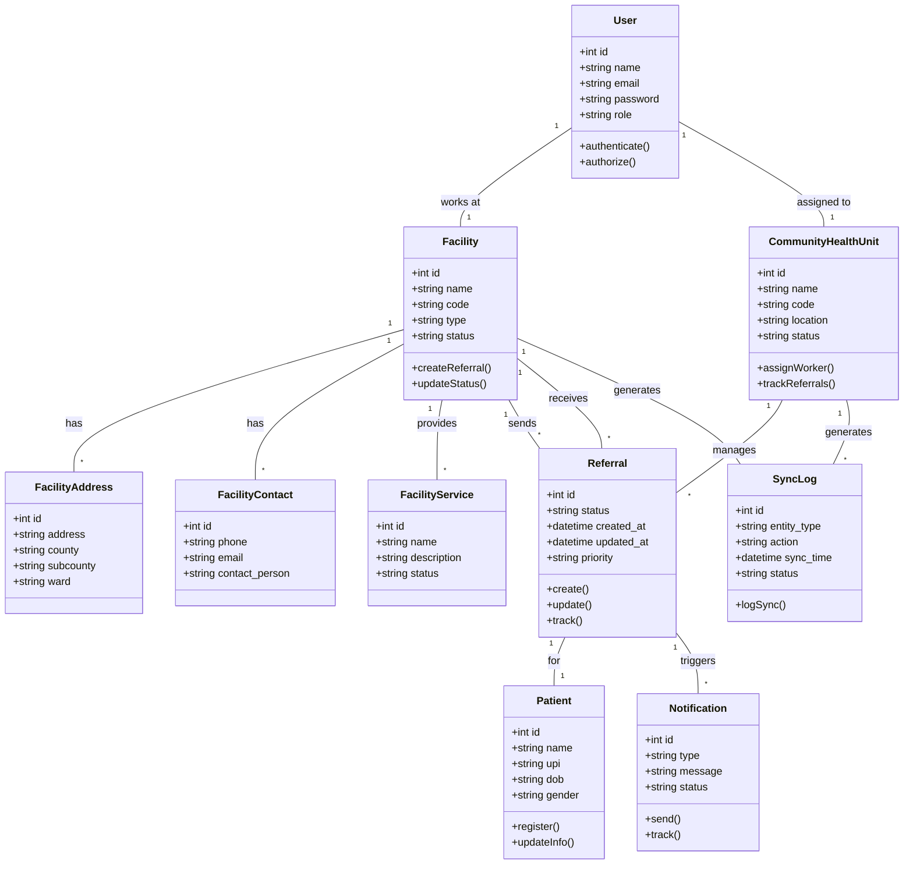

# Class Diagram

```mermaid
classDiagram
    %% Core Entities
    class User {
        +int id
        +string name
        +string email
        +string password
        +string role
        +authenticate()
        +authorize()
    }
    
    class Facility {
        +int id
        +string name
        +string code
        +string type
        +string status
        +createReferral()
        +updateStatus()
    }
    
    class CommunityHealthUnit {
        +int id
        +string name
        +string code
        +string location
        +string status
        +assignWorker()
        +trackReferrals()
    }
    
    class Referral {
        +int id
        +string status
        +datetime created_at
        +datetime updated_at
        +string priority
        +create()
        +update()
        +track()
    }
    
    class Patient {
        +int id
        +string name
        +string upi
        +string dob
        +string gender
        +register()
        +updateInfo()
    }
    
    %% Supporting Classes
    class FacilityAddress {
        +int id
        +string address
        +string county
        +string subcounty
        +string ward
    }
    
    class FacilityContact {
        +int id
        +string phone
        +string email
        +string contact_person
    }
    
    class FacilityService {
        +int id
        +string name
        +string description
        +string status
    }
    
    class SyncLog {
        +int id
        +string entity_type
        +string action
        +datetime sync_time
        +string status
        +logSync()
    }
    
    class Notification {
        +int id
        +string type
        +string message
        +string status
        +send()
        +track()
    }
    
    %% Relationships
    User "1" -- "1" Facility : works at
    User "1" -- "1" CommunityHealthUnit : assigned to
    Facility "1" -- "*" FacilityAddress : has
    Facility "1" -- "*" FacilityContact : has
    Facility "1" -- "*" FacilityService : provides
    Facility "1" -- "*" Referral : sends
    Facility "1" -- "*" Referral : receives
    CommunityHealthUnit "1" -- "*" Referral : manages
    Referral "1" -- "1" Patient : for
    Referral "1" -- "*" Notification : triggers
    Facility "1" -- "*" SyncLog : generates
    CommunityHealthUnit "1" -- "*" SyncLog : generates
```
