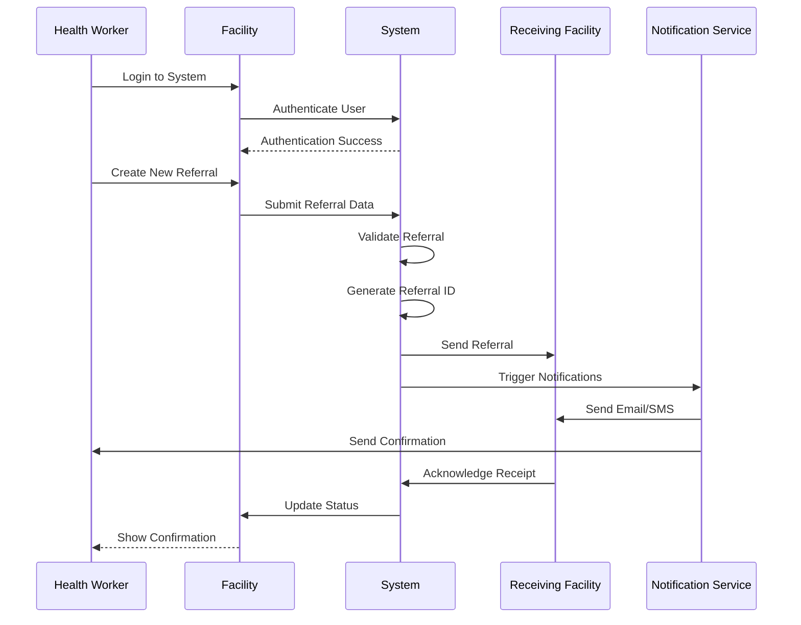
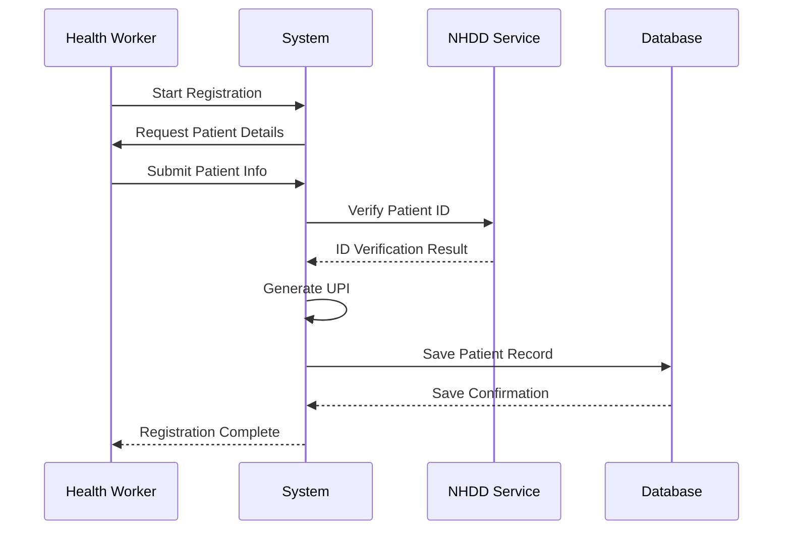
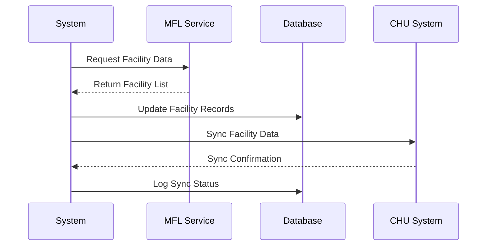
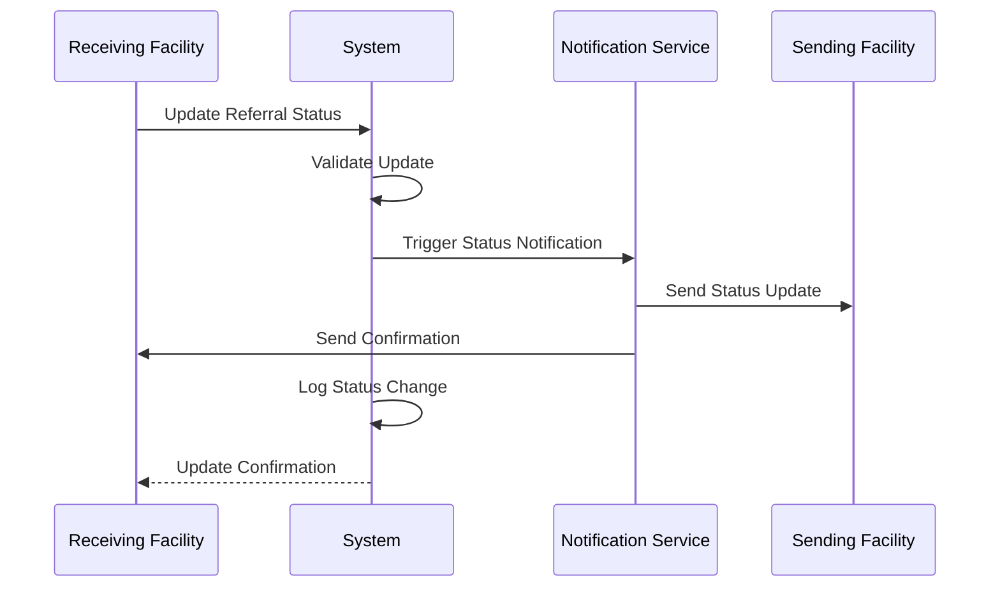
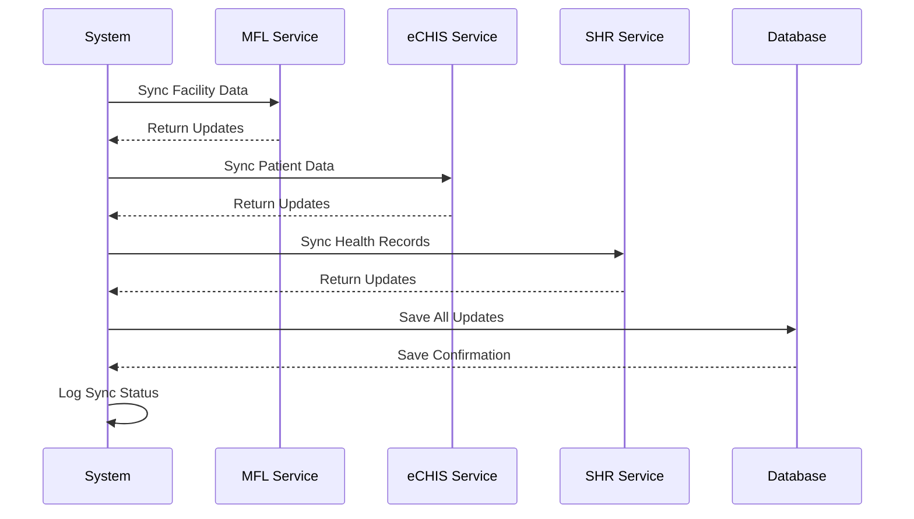

# Sequence Diagram

## Referral Creation Flow

```mermaid
sequenceDiagram
    participant HW as Health Worker
    participant F as Facility
    participant S as System
    participant RF as Receiving Facility
    participant N as Notification Service

    HW->>F: Login to System
    F->>S: Authenticate User
    S-->>F: Authentication Success
    HW->>F: Create New Referral
    F->>S: Submit Referral Data
    S->>S: Validate Referral
    S->>S: Generate Referral ID
    S->>RF: Send Referral
    S->>N: Trigger Notifications
    N->>RF: Send Email/SMS
    N->>HW: Send Confirmation
    RF->>S: Acknowledge Receipt
    S->>F: Update Status
    F-->>HW: Show Confirmation
```

## Patient Registration Flow

```mermaid
sequenceDiagram
    participant HW as Health Worker
    participant S as System
    participant NHDD as NHDD Service
    participant DB as Database

    HW->>S: Start Registration
    S->>HW: Request Patient Details
    HW->>S: Submit Patient Info
    S->>NHDD: Verify Patient ID
    NHDD-->>S: ID Verification Result
    S->>S: Generate UPI
    S->>DB: Save Patient Record
    DB-->>S: Save Confirmation
    S-->>HW: Registration Complete
```

## Facility-CHU Integration Flow

```mermaid
sequenceDiagram
    participant S as System
    participant MFL as MFL Service
    participant DB as Database
    participant CHU as CHU System

    S->>MFL: Request Facility Data
    MFL-->>S: Return Facility List
    S->>DB: Update Facility Records
    S->>CHU: Sync Facility Data
    CHU-->>S: Sync Confirmation
    S->>DB: Log Sync Status
```

## Referral Status Update Flow

```mermaid
sequenceDiagram
    participant RF as Receiving Facility
    participant S as System
    participant N as Notification Service
    participant SF as Sending Facility

    RF->>S: Update Referral Status
    S->>S: Validate Update
    S->>N: Trigger Status Notification
    N->>SF: Send Status Update
    N->>RF: Send Confirmation
    S->>S: Log Status Change
    S-->>RF: Update Confirmation
```

## Data Synchronization Flow

```mermaid
sequenceDiagram
    participant S as System
    participant MFL as MFL Service
    participant eCHIS as eCHIS Service
    participant SHR as SHR Service
    participant DB as Database

    S->>MFL: Sync Facility Data
    MFL-->>S: Return Updates
    S->>eCHIS: Sync Patient Data
    eCHIS-->>S: Return Updates
    S->>SHR: Sync Health Records
    SHR-->>S: Return Updates
    S->>DB: Save All Updates
    DB-->>S: Save Confirmation
    S->>S: Log Sync Status
```
