# System Diagrams

This section provides visual representations of the Angaza Referral System's architecture, processes, and data flows.

## Process Flow Diagrams

### Authentication Flow
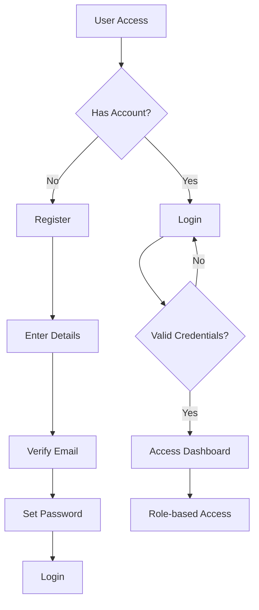

### Referral Process Flow
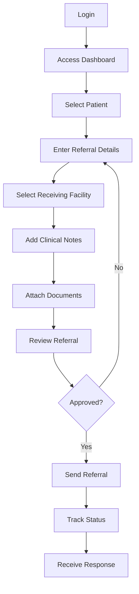

### Patient Management Flow
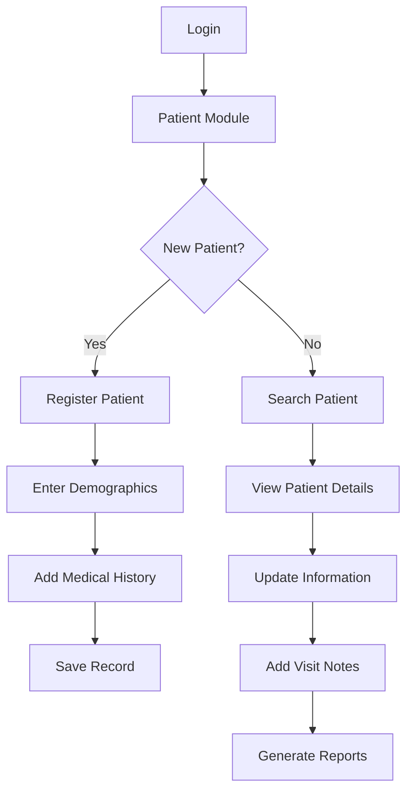

### Facility Management Flow
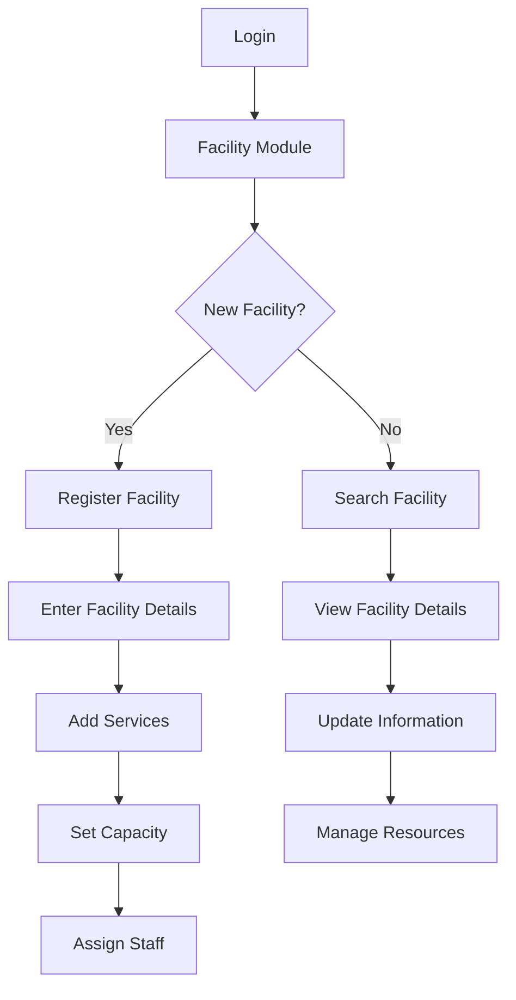

### Reporting Flow
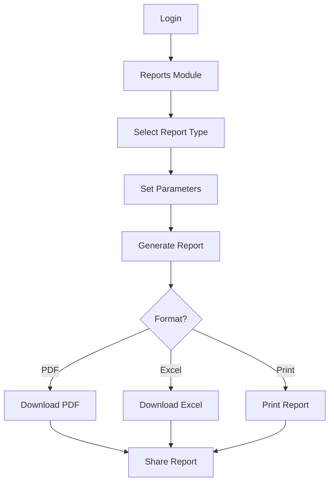

### User Management Flow
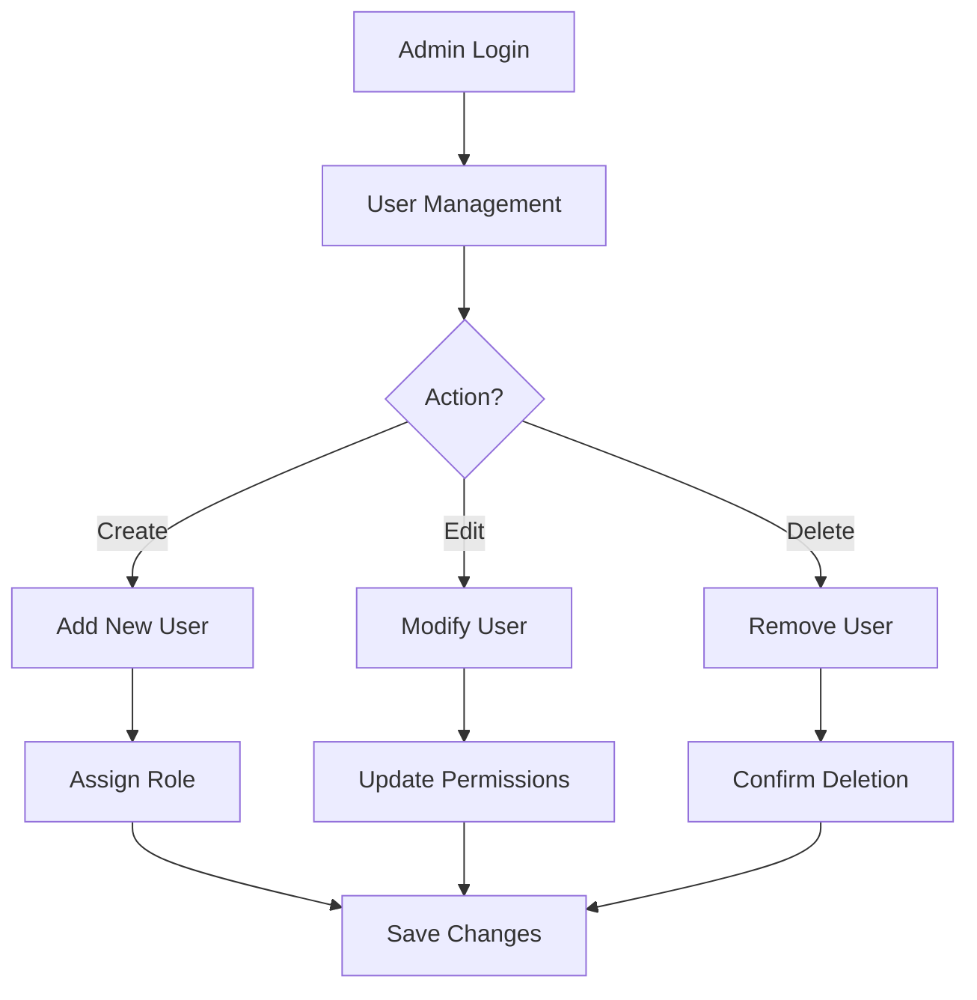

### Notification Flow
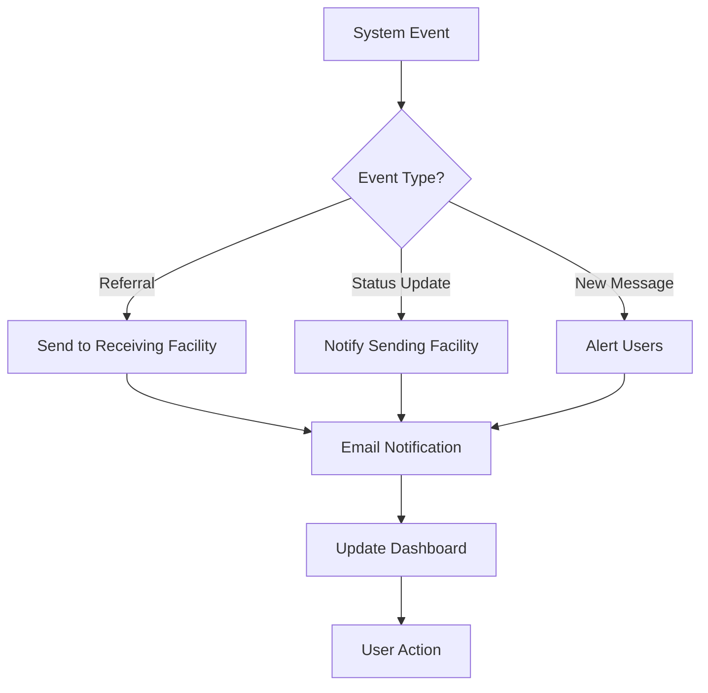

### Data Synchronization Flow
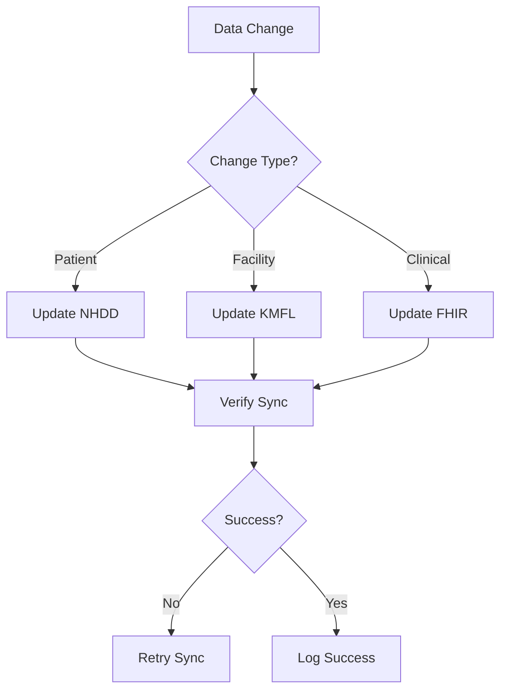

## Module Interactions

### Cross-Module Communication
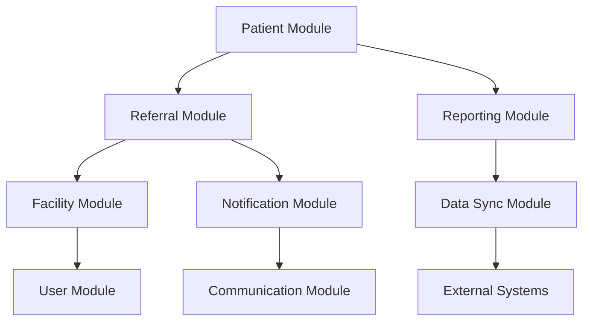

### Data Flow Between Modules
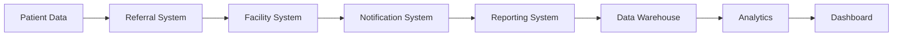

## System States

### Referral Status Flow
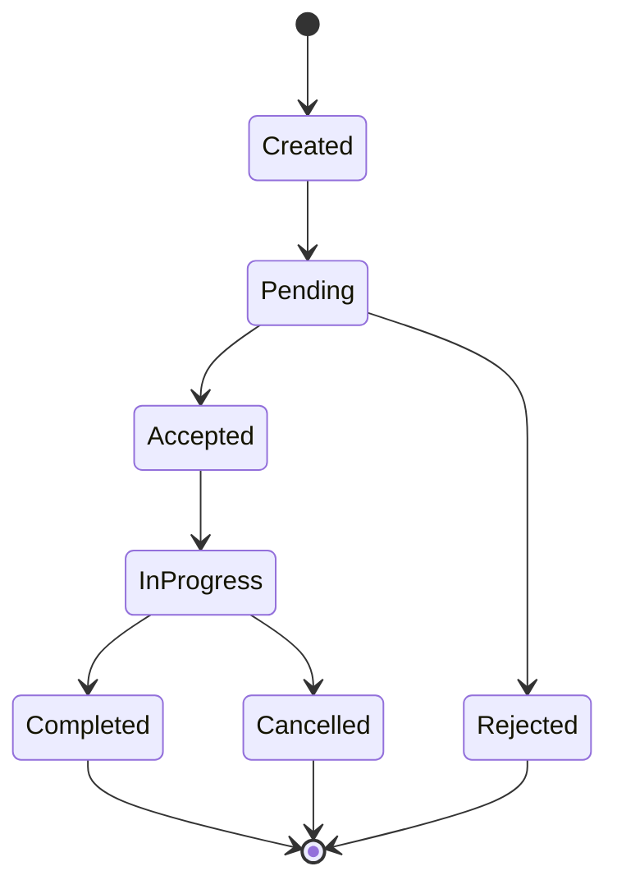

### User Session States
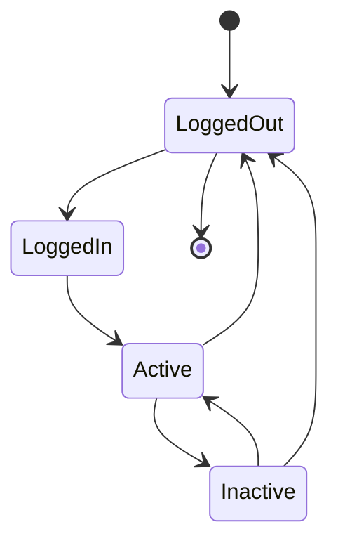

These diagrams provide a comprehensive view of the system's processes, user journeys, and module interactions. Each diagram is designed to help users and developers understand the flow of information and actions within the system.

## Usage Guidelines

1. **For Users**
   - Follow the process flows to understand system navigation
   - Use the module interaction diagrams to understand system connectivity
   - Refer to state diagrams for status tracking

2. **For Developers**
   - Use these diagrams as reference for implementation
   - Follow the data flow patterns for integration
   - Maintain consistency with the defined processes

3. **For Administrators**
   - Use the user management flow for system administration
   - Monitor the notification flow for system alerts
   - Track the data synchronization flow for system health

## Process Flow Diagram

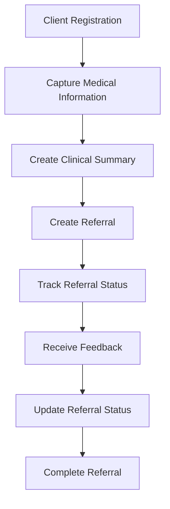

The flowchart shows the high-level process flow for the patient referral system. The process begins with client registration, and continues with the capture of medical information and clinical summary. A referral is then created, and the referral status is tracked until feedback is received.

## Use Case Diagram

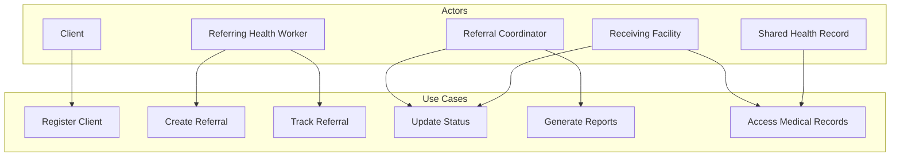

The use case diagram shows the different actors that interact with the patient referral system and the use cases that they can perform. The actors include:
- Client
- Referring health worker
- Referral coordinator
- Receiving facility
- Shared health record

## Activity Diagram

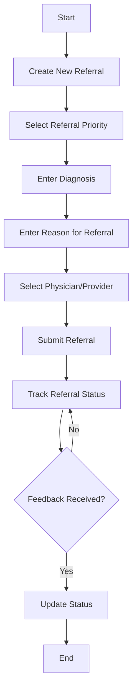

The activity diagram shows the detailed process flow for creating a referral in the patient referral system. The process includes:
1. Creation of a new referral
2. Selection of the referral priority
3. Entry of the diagnosis
4. Entry of the reason for referral
5. Selection of the physician/provider
6. Submission of the referral
7. Tracking of the referral status until feedback is received

## Data Flow Diagram

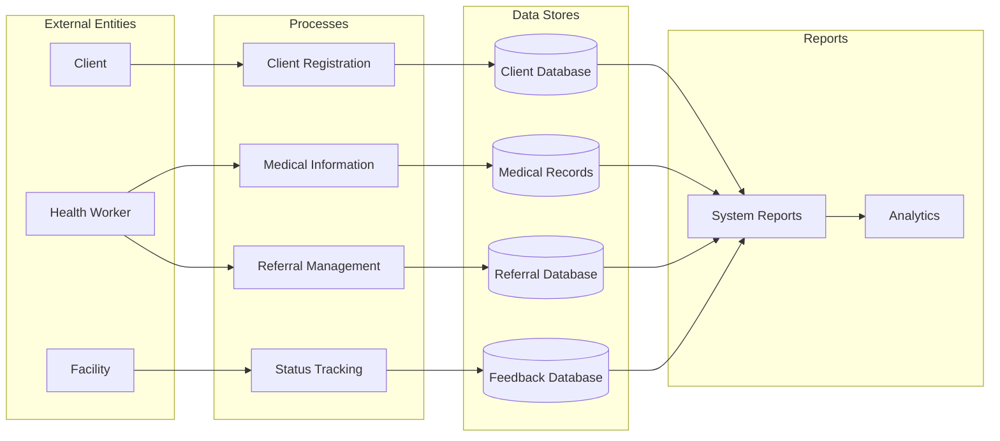

The data flow diagram shows the flow of information in the patient referral system. The system:
1. Captures information about clients, medical information, referrals, and feedback
2. Stores this information in appropriate databases
3. Uses the information to generate reports
4. Provides feedback to the referring health worker

## System Architecture

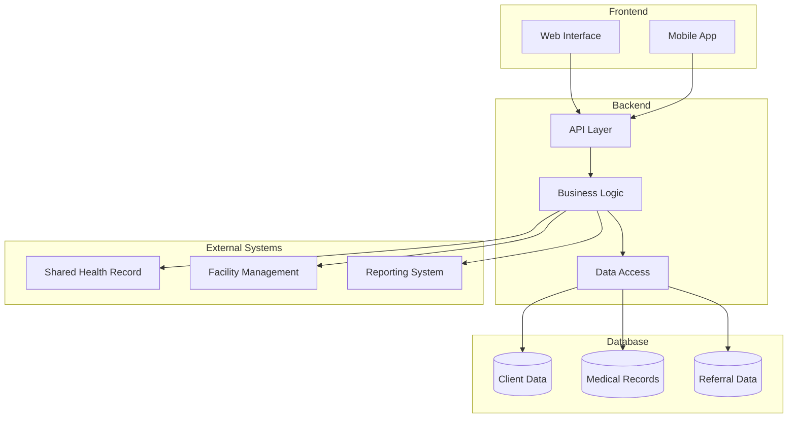

This diagram shows the high-level architecture of the Angaza Referral System, including:
- Frontend components (web interface and mobile app)
- Backend services (API layer, business logic, and data access)
- Database systems
- External system integrations 

## Visual Flowcharts

### Complete System Flow
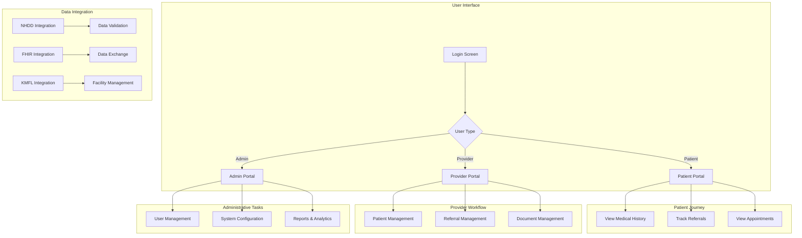

### Patient Registration Flow
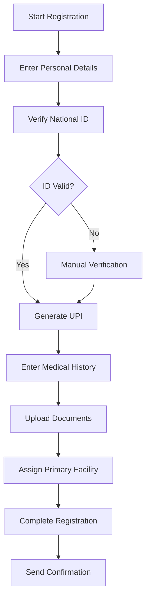

### Referral Processing Flow
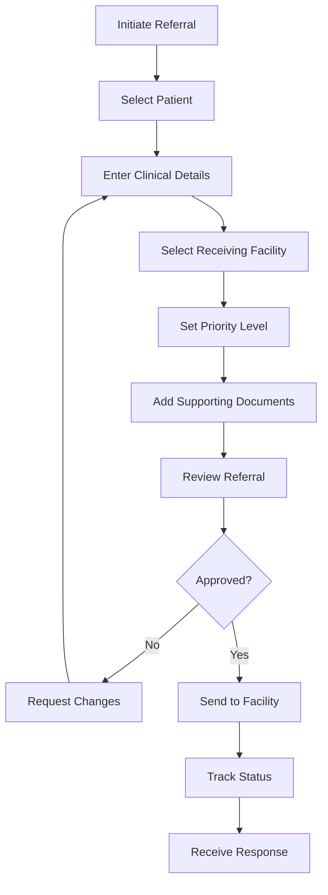

### Facility Management Flow
```mermaid
flowchart TD
    A[Facility Registration] --> B[Enter Facility Details]
    B --> C[Verify KMFL Code]
    C --> D[Add Services]
    D --> E[Set Capacity]
    E --> F[Assign Staff]
    F --> G[Configure Integration]
    G --> H[Complete Setup]
    H --> I[Start Operations]
```

### Data Synchronization Flow
```mermaid
flowchart TD
    A[Data Change] --> B{Change Type}
    B -->|Patient| C[Update NHDD]
    B -->|Facility| D[Update KMFL]
    B -->|Clinical| E[Update FHIR]
    C --> F[Verify Sync]
    D --> F
    E --> F
    F --> G{Success?}
    G -->|No| H[Retry Sync]
    G -->|Yes| I[Log Success]
    H --> F
```

### Reporting System Flow
```mermaid
flowchart TD
    A[Generate Report] --> B{Report Type}
    B -->|Patient| C[Patient Reports]
    B -->|Facility| D[Facility Reports]
    B -->|System| E[System Reports]
    C --> F[Select Parameters]
    D --> F
    E --> F
    F --> G[Process Data]
    G --> H[Generate Output]
    H --> I{Format}
    I -->|PDF| J[Download PDF]
    I -->|Excel| K[Download Excel]
    I -->|Print| L[Print Report]
```

### Emergency Referral Flow
```mermaid
flowchart TD
    A[Emergency Case] --> B[Quick Registration]
    B --> C[Basic Details Only]
    C --> D[Immediate Referral]
    D --> E[High Priority Flag]
    E --> F[Direct Facility Contact]
    F --> G[Track Response]
    G --> H[Update Status]
    H --> I[Complete Documentation]
```

### Quality Assurance Flow
```mermaid
flowchart TD
    A[QA Process] --> B[Review Referral]
    B --> C{Meets Standards?}
    C -->|No| D[Request Changes]
    C -->|Yes| E[Approve]
    D --> F[Update Documentation]
    F --> B
    E --> G[Monitor Outcomes]
    G --> H[Generate QA Report]
```

### Integration Flow
```mermaid
flowchart TD
    A[External System] --> B{Integration Type}
    B -->|NHDD| C[Patient Data]
    B -->|KMFL| D[Facility Data]
    B -->|FHIR| E[Clinical Data]
    C --> F[Validate]
    D --> F
    E --> F
    F --> G{Valid?}
    G -->|No| H[Error Handling]
    G -->|Yes| I[Process Data]
    H --> J[Log Error]
    I --> K[Update System]
```

### Security Flow
```mermaid
flowchart TD
    A[Access Request] --> B{Authentication}
    B -->|Success| C[Authorization]
    B -->|Failed| D[Access Denied]
    C --> E{Has Permission?}
    E -->|Yes| F[Grant Access]
    E -->|No| D
    F --> G[Log Access]
    G --> H[Monitor Activity]
```

These flowcharts provide a comprehensive visual representation of the system's various processes and workflows. Each flowchart is designed to help users and developers understand the specific processes and their interactions within the system.

## Usage Guidelines

1. **For Users**
   - Follow the flowcharts to understand process sequences
   - Use the diagrams to identify decision points
   - Reference the flows for troubleshooting

2. **For Developers**
   - Use the flows for implementation guidance
   - Follow the process sequences for development
   - Reference the integration flows for system connections

3. **For Administrators**
   - Use the flows for process monitoring
   - Reference the security flows for access management
   - Follow the QA flows for system maintenance 