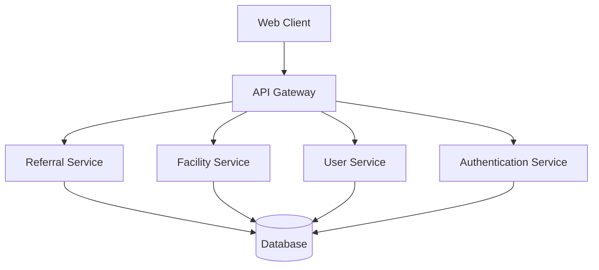

# System Overview

The Angaza Referral System is a comprehensive healthcare referral management platform designed to streamline and improve the patient referral process between healthcare facilities.

## System Architecture

### High-Level Architecture

### Key Components

1. **Web Client**
   - React.js-based single-page application
   - Material-UI components for consistent user interface
   - Responsive design for desktop and mobile access

2. **API Gateway**
   - Node.js/Express.js backend
   - RESTful API endpoints
   - Request validation and sanitization
   - Rate limiting and security measures

3. **Core Services**
   - Authentication Service: User authentication and authorization
   - Referral Service: Manages patient referrals and their lifecycle
   - Facility Service: Handles healthcare facility management
   - User Service: Manages user accounts and permissions

4. **Database**
   - PostgreSQL relational database
   - Optimized schema for healthcare data
   - Data encryption at rest
   - Regular backups and disaster recovery

## Key Features

### 1. Referral Management
- Create and track patient referrals
- Real-time status updates
- Automated notifications
- Referral history and audit trail

### 2. Facility Management
- Facility registration and verification
- Service catalog management
- Capacity and availability tracking
- Inter-facility communication

### 3. User Management
- Role-based access control
- Multi-level user permissions
- User activity logging
- Secure authentication

### 4. Reporting and Analytics
- Referral statistics and trends
- Facility performance metrics
- User activity reports
- Custom report generation

## Security Features

1. **Authentication**
   - JWT-based authentication
   - Password hashing with bcrypt
   - Session management
   - Two-factor authentication support

2. **Authorization**
   - Role-based access control (RBAC)
   - Permission-based access control
   - API endpoint protection
   - Resource-level security

3. **Data Protection**
   - Data encryption in transit (HTTPS)
   - Data encryption at rest
   - Regular security audits
   - Compliance with healthcare data standards

## Integration Capabilities

1. **External Systems**
   - HL7 FHIR integration
   - Electronic Health Records (EHR) systems
   - Hospital Information Systems (HIS)
   - Laboratory Information Systems (LIS)

2. **Communication Channels**
   - Email notifications
   - SMS alerts
   - Push notifications
   - Webhook support

## Performance and Scalability

1. **Performance Optimization**
   - Database query optimization
   - Caching mechanisms
   - Load balancing
   - CDN integration

2. **Scalability Features**
   - Horizontal scaling support
   - Microservices architecture
   - Containerization with Docker
   - Kubernetes orchestration

## Monitoring and Maintenance

1. **System Monitoring**
   - Real-time performance monitoring
   - Error tracking and logging
   - Resource utilization metrics
   - Alert system

2. **Maintenance Procedures**
   - Automated backups
   - Database maintenance
   - System updates
   - Disaster recovery

## Compliance and Standards

1. **Healthcare Standards**
   - HL7 compliance
   - FHIR implementation
   - ICD-11 coding support
   - HIPAA compliance

2. **Data Standards**
   - Standardized data formats
   - Data validation rules
   - Data quality checks
   - Audit trail requirements

## Future Enhancements

1. **Planned Features**
   - AI-powered referral recommendations
   - Advanced analytics dashboard
   - Mobile application
   - Telemedicine integration

2. **Technical Roadmap**
   - Microservices expansion
   - Cloud-native architecture
   - Enhanced security features
   - Performance optimizations

## Related Documentation

- [Class Diagram](class-diagram.md)
- [Sequence Diagrams](sequence-diagram.md)
- [System Components](system-components.md)
- [Security Architecture](security.md)
- [Integration Guide](integration.md)
- [Performance Guidelines](performance.md) 