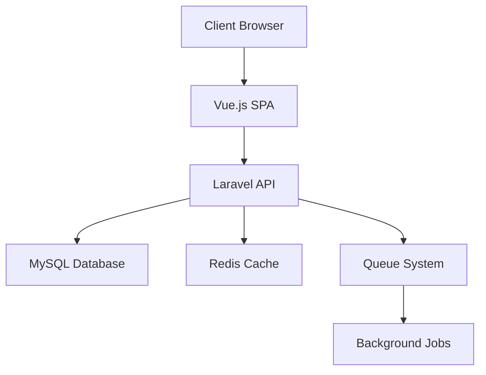

# System Architecture

This document describes the architecture of the Angaza Referral System.

## Overview

The system follows a modern web application architecture with the following components:

- Frontend: Vue.js SPA
- Backend: Laravel REST API
- Database: MySQL
- Cache: Redis
- Queue: Laravel Horizon

## System Components

### Frontend
- Vue.js for UI components
- Vuex for state management
- Vue Router for navigation
- Axios for API communication
- Tailwind CSS for styling

### Backend
- Laravel framework
- RESTful API endpoints
- JWT authentication
- Role-based access control
- Queue system for background jobs

### Database
- MySQL for primary storage
- Redis for caching
- Database migrations
- Data seeding
- Backup system

## Architecture Diagram

## Security

### Authentication
- JWT-based authentication
- Token refresh mechanism
- Session management
- Password hashing

### Authorization
- Role-based access control
- Permission system
- API rate limiting
- CORS configuration

## Performance

### Caching
- Redis for data caching
- Browser caching
- API response caching
- Query caching

### Optimization
- Database indexing
- Query optimization
- Asset minification
- Lazy loading

## Deployment

### Infrastructure
- Docker containers
- Nginx web server
- PHP-FPM
- MySQL server
- Redis server

### CI/CD
- GitHub Actions
- Automated testing
- Deployment pipeline
- Environment configuration

## Monitoring

### Logging
- Application logs
- Error tracking
- Performance metrics
- User activity

### Alerts
- Error notifications
- Performance alerts
- Security alerts
- System health checks 