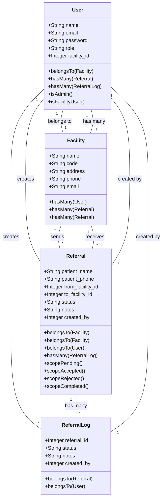

# Class Diagram

This document shows the relationships between the main models in the Angaza Referral System.

## Model Relationships

### User Model
- Belongs to one `Facility`
- Has many `Referrals` (created)
- Has many `ReferralLogs` (created)

### Facility Model
- Has many `Users`
- Has many `Referrals` (outgoing)
- Has many `Referrals` (incoming)

### Referral Model
- Belongs to `Facility` (from)
- Belongs to `Facility` (to)
- Belongs to `User` (creator)
- Has many `ReferralLogs`

### ReferralLog Model
- Belongs to `Referral`
- Belongs to `User` (creator)

## Key Features

1. **User Management**
   - Role-based access control
   - Facility association
   - Authentication and authorization

2. **Facility Management**
   - Facility details
   - User associations
   - Referral tracking

3. **Referral Management**
   - Patient information
   - Facility routing
   - Status tracking
   - Logging

4. **Logging System**
   - Status changes
   - User actions
   - Audit trail 