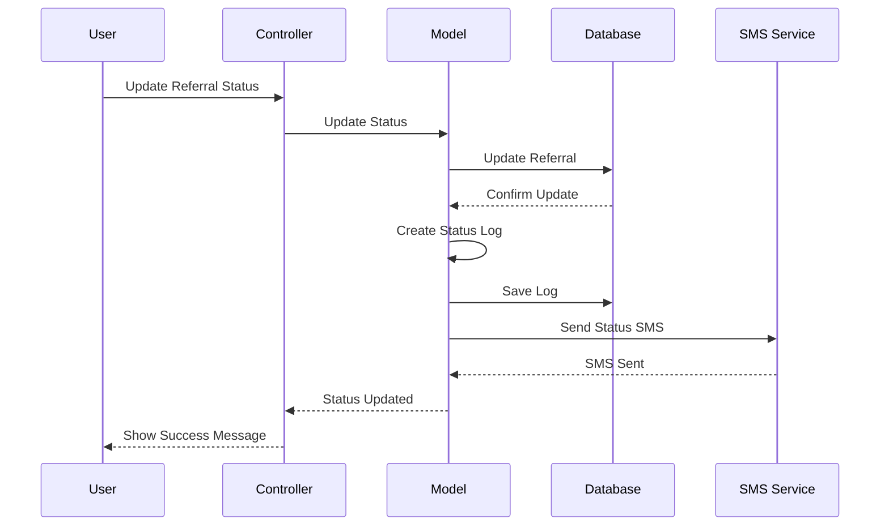
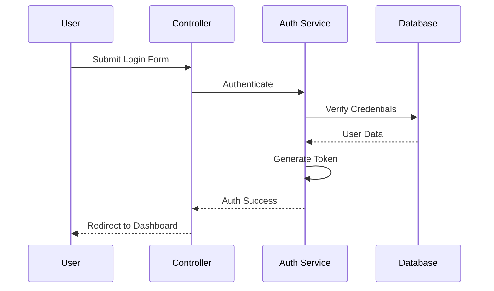

# Sequence Diagram

This document shows the sequence of interactions between different components during key processes in the Angaza Referral System.

## Referral Creation Process

## Referral Status Update Process

## User Authentication Process

## Key Processes

1. **Referral Creation**
   - Form submission
   - Data validation
   - Database storage
   - Log creation
   - SMS notification

2. **Status Updates**
   - Status change request
   - Database update
   - Log creation
   - SMS notification
   - UI update

3. **Authentication**
   - Credential submission
   - Verification
   - Token generation
   - Session creation
   - Dashboard access

## Process Notes

1. **Data Validation**
   - All inputs are validated before processing
   - Validation rules are defined in the models
   - Error messages are returned for invalid data

2. **Error Handling**
   - Database errors are caught and logged
   - User-friendly error messages are displayed
   - Failed operations are rolled back

3. **Notifications**
   - SMS notifications are sent asynchronously
   - Email notifications are queued
   - System logs are maintained for all operations 